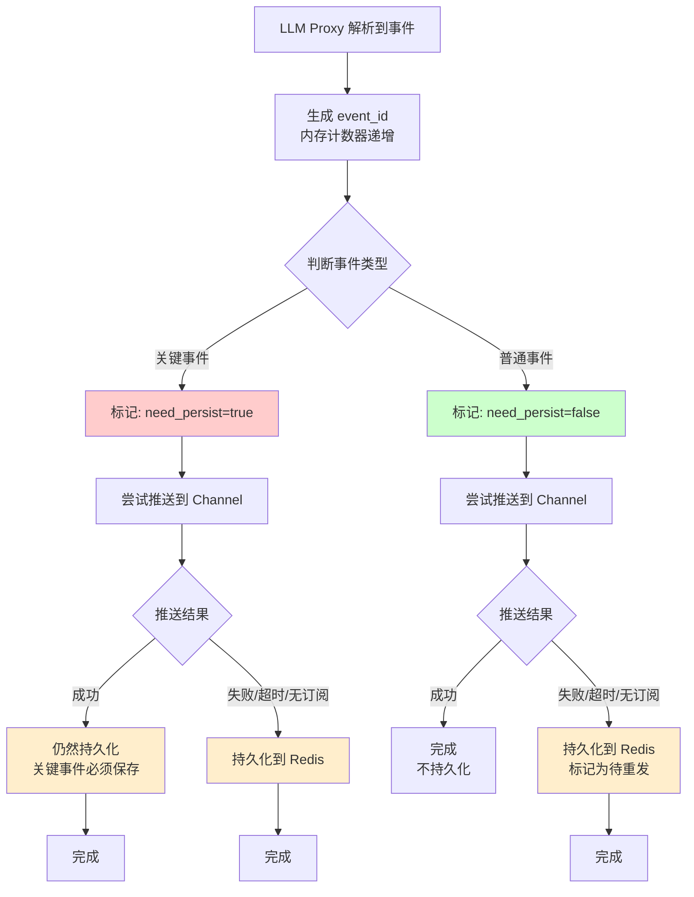

```mermaid
graph TB
    Start[LLM Proxy 解析到事件]
    
    Start --> Generate[生成 event_id<br/>内存计数器递增]
    
    Generate --> Judge{判断事件类型}
    
    Judge -->|关键事件| Critical[标记: need_persist=true]
    Judge -->|普通事件| Normal[标记: need_persist=false]
    
    Critical --> TryPush1[尝试推送到 Channel]
    Normal --> TryPush2[尝试推送到 Channel]
    
    TryPush1 --> PushResult1{推送结果}
    TryPush2 --> PushResult2{推送结果}
    
    PushResult1 -->|成功| Persist1[仍然持久化<br/>关键事件必须保存]
    PushResult1 -->|失败/超时/无订阅| Persist2[持久化到 Redis]
    
    PushResult2 -->|成功| Done1[完成<br/>不持久化]
    PushResult2 -->|失败/超时/无订阅| Persist3[持久化到 Redis<br/>标记为待重发]
    
    Persist1 --> Done2[完成]
    Persist2 --> Done3[完成]
    Persist3 --> Done4[完成]
    
    style Critical fill:#ffcccc
    style Normal fill:#ccffcc
    style Persist1 fill:#ffeecc
    style Persist2 fill:#ffeecc
    style Persist3 fill:#ffeecc
```