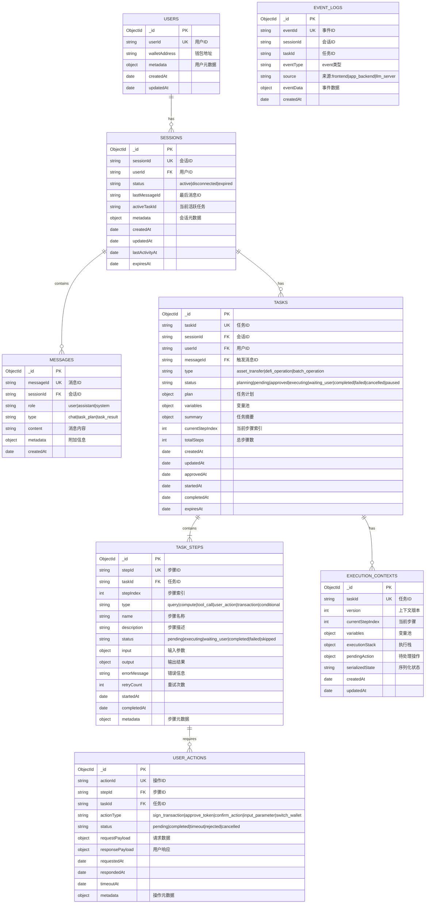

```mermaid
erDiagram
    USERS ||--o{ SESSIONS : has
    SESSIONS ||--o{ MESSAGES : contains
    SESSIONS ||--o{ TASKS : has
    TASKS ||--|{ TASK_STEPS : contains
    TASK_STEPS ||--o{ USER_ACTIONS : requires
    TASKS ||--o{ EXECUTION_CONTEXTS : has
    
    USERS {
        ObjectId _id PK
        string userId UK "用户ID"
        string walletAddress "钱包地址"
        object metadata "用户元数据"
        date createdAt
        date updatedAt
    }
    
    SESSIONS {
        ObjectId _id PK
        string sessionId UK "会话ID"
        string userId FK "用户ID"
        string status "active|disconnected|expired"
        string lastMessageId "最后消息ID"
        string activeTaskId "当前活跃任务"
        object metadata "会话元数据"
        date createdAt
        date updatedAt
        date lastActivityAt
        date expiresAt
    }
    
    MESSAGES {
        ObjectId _id PK
        string messageId UK "消息ID"
        string sessionId FK "会话ID"
        string role "user|assistant|system"
        string type "chat|task_plan|task_result"
        string content "消息内容"
        object metadata "附加信息"
        date createdAt
    }
    
    TASKS {
        ObjectId _id PK
        string taskId UK "任务ID"
        string sessionId FK "会话ID"
        string userId FK "用户ID"
        string messageId FK "触发消息ID"
        string type "asset_transfer|defi_operation|batch_operation"
        string status "planning|pending|approved|executing|waiting_user|completed|failed|cancelled|paused"
        object plan "任务计划"
        object variables "变量池"
        object summary "任务摘要"
        int currentStepIndex "当前步骤索引"
        int totalSteps "总步骤数"
        date createdAt
        date updatedAt
        date approvedAt
        date startedAt
        date completedAt
        date expiresAt
    }
    
    TASK_STEPS {
        ObjectId _id PK
        string stepId UK "步骤ID"
        string taskId FK "任务ID"
        int stepIndex "步骤索引"
        string type "query|compute|tool_call|user_action|transaction|conditional"
        string name "步骤名称"
        string description "步骤描述"
        string status "pending|executing|waiting_user|completed|failed|skipped"
        object input "输入参数"
        object output "输出结果"
        string errorMessage "错误信息"
        int retryCount "重试次数"
        date startedAt
        date completedAt
        object metadata "步骤元数据"
    }
    
    USER_ACTIONS {
        ObjectId _id PK
        string actionId UK "操作ID"
        string stepId FK "步骤ID"
        string taskId FK "任务ID"
        string actionType "sign_transaction|approve_token|confirm_action|input_parameter|switch_wallet"
        string status "pending|completed|timeout|rejected|cancelled"
        object requestPayload "请求数据"
        object responsePayload "用户响应"
        date requestedAt
        date respondedAt
        date timeoutAt
        object metadata "操作元数据"
    }
    
    EXECUTION_CONTEXTS {
        ObjectId _id PK
        string taskId UK "任务ID"
        int version "上下文版本"
        int currentStepIndex "当前步骤"
        object variables "变量池"
        object executionStack "执行栈"
        object pendingAction "待处理操作"
        string serializedState "序列化状态"
        date createdAt
        date updatedAt
    }
    
    EVENT_LOGS {
        ObjectId _id PK
        string eventId UK "事件ID"
        string sessionId "会话ID"
        string taskId "任务ID"
        string eventType "event类型"
        string source "来源:frontend|app_backend|llm_server"
        object eventData "事件数据"
        date createdAt
    }
```