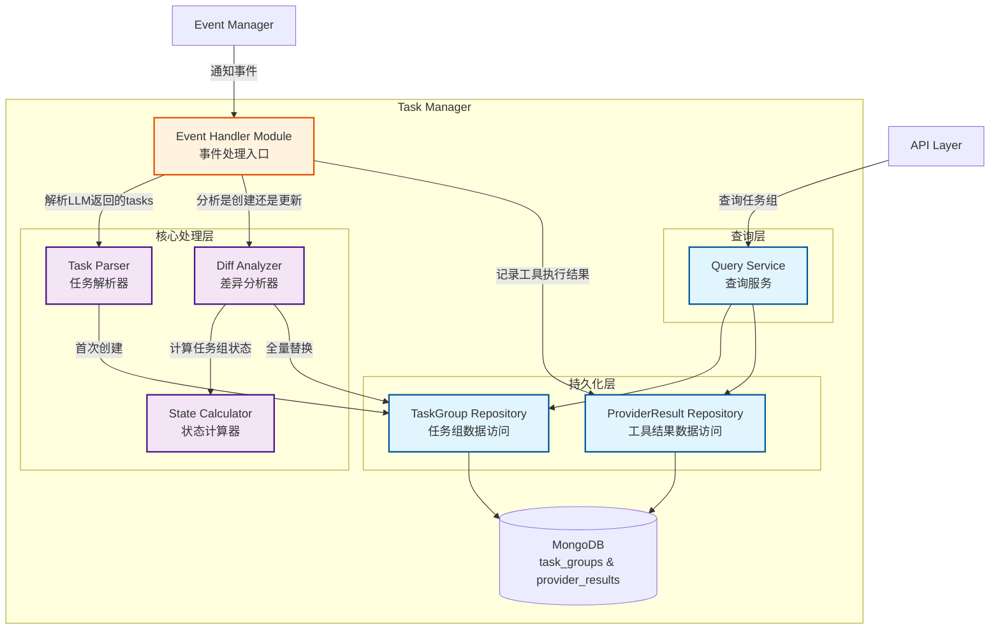

```mermaid
graph TB
    subgraph "Task Manager"
        direction TB
        
        EventHandler["Event Handler Module<br/>事件处理入口"]
        
        subgraph "核心处理层"
            StateCalc["State Calculator<br/>状态计算器"]
            TaskParser["Task Parser<br/>任务解析器"]
            DiffAnalyzer["Diff Analyzer<br/>差异分析器"]
        end
        
        subgraph "持久化层"
            TaskGroupRepo["TaskGroup Repository<br/>任务组数据访问"]
            ProviderResultRepo["ProviderResult Repository<br/>工具结果数据访问"]
        end
        
        subgraph "查询层"
            QueryService["Query Service<br/>查询服务"]
        end
        
        MongoDB[("MongoDB<br/>task_groups & provider_results")]
    end
    
    EventMgr["Event Manager"]
    API["API Layer"]
    
    EventMgr -->|"通知事件"| EventHandler
    
    EventHandler -->|"解析LLM返回的tasks"| TaskParser
    EventHandler -->|"分析是创建还是更新"| DiffAnalyzer
    
    DiffAnalyzer -->|"计算任务组状态"| StateCalc
    
    TaskParser -->|"首次创建"| TaskGroupRepo
    DiffAnalyzer -->|"全量替换"| TaskGroupRepo
    
    EventHandler -->|"记录工具执行结果"| ProviderResultRepo
    
    TaskGroupRepo --> MongoDB
    ProviderResultRepo --> MongoDB
    
    API -->|"查询任务组"| QueryService
    QueryService --> TaskGroupRepo
    QueryService --> ProviderResultRepo
    
    classDef handler fill:#fff3e0,stroke:#e65100,stroke-width:2px
    classDef processor fill:#f3e5f5,stroke:#4a148c,stroke-width:2px
    classDef storage fill:#e1f5ff,stroke:#01579b,stroke-width:2px
    
    class EventHandler handler
    class StateCalc,TaskParser,DiffAnalyzer processor
    class TaskGroupRepo,ProviderResultRepo,QueryService storage
```