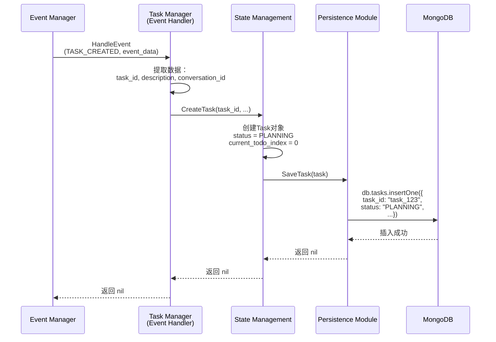

```mermaid
sequenceDiagram
    participant EventMgr as Event Manager
    participant TaskMgr as Task Manager<br/>(Event Handler)
    participant StateMgr as State Management
    participant Persist as Persistence Module
    participant MongoDB as MongoDB

    EventMgr->>TaskMgr: HandleEvent<br/>(TASK_CREATED, event_data)
    
    TaskMgr->>TaskMgr: 提取数据：<br/>task_id, description, conversation_id
    
    TaskMgr->>StateMgr: CreateTask(task_id, ...)
    
    StateMgr->>StateMgr: 创建Task对象<br/>status = PLANNING<br/>current_todo_index = 0
    
    StateMgr->>Persist: SaveTask(task)
    
    Persist->>MongoDB: db.tasks.insertOne({<br/>  task_id: "task_123",<br/>  status: "PLANNING",<br/>  ...})
    
    MongoDB-->>Persist: 插入成功
    Persist-->>StateMgr: 返回 nil
    StateMgr-->>TaskMgr: 返回 nil
    TaskMgr-->>EventMgr: 返回 nil
```