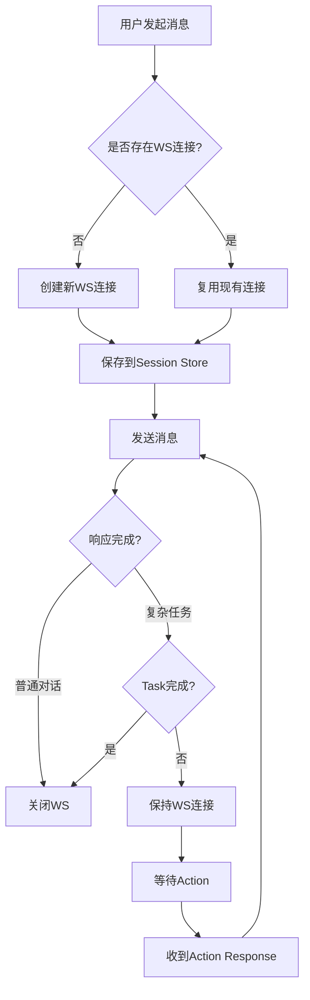

```mermaid
graph TD
    A[用户发起消息] --> B{是否存在WS连接?}
    B -->|否| C[创建新WS连接]
    B -->|是| D[复用现有连接]
    
    C --> E[保存到Session Store]
    D --> E
    
    E --> F[发送消息]
    F --> G{响应完成?}
    
    G -->|普通对话| H[关闭WS]
    G -->|复杂任务| I{Task完成?}
    
    I -->|否| J[保持WS连接]
    J --> K[等待Action]
    K --> L[收到Action Response]
    L --> F
    
    I -->|是| H
```