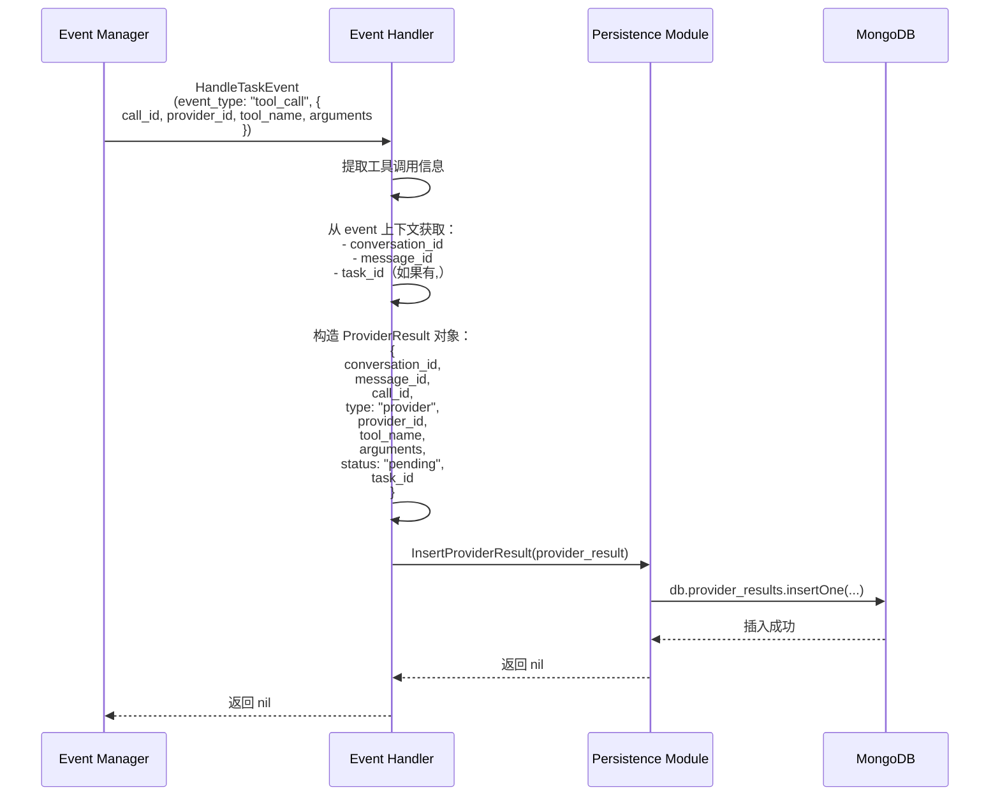

```mermaid
sequenceDiagram
    participant EM as Event Manager
    participant EH as Event Handler
    participant Persist as Persistence Module
    participant DB as MongoDB

    EM->>EH: HandleTaskEvent<br/>(event_type: "tool_call", {<br/>  call_id, provider_id, tool_name, arguments<br/>})
    
    EH->>EH: 提取工具调用信息
    
    EH->>EH: 从 event 上下文获取：<br/>- conversation_id<br/>- message_id<br/>- task_id（如果有,）
    
    EH->>EH: 构造 ProviderResult 对象：<br/>{<br/>  conversation_id,<br/>  message_id,<br/>  call_id,<br/>  type: "provider",<br/>  provider_id,<br/>  tool_name,<br/>  arguments,<br/>  status: "pending",<br/>  task_id<br/>}
    
    EH->>Persist: InsertProviderResult(provider_result)
    Persist->>DB: db.provider_results.insertOne(...)
    DB-->>Persist: 插入成功
    
    Persist-->>EH: 返回 nil
    EH-->>EM: 返回 nil
```