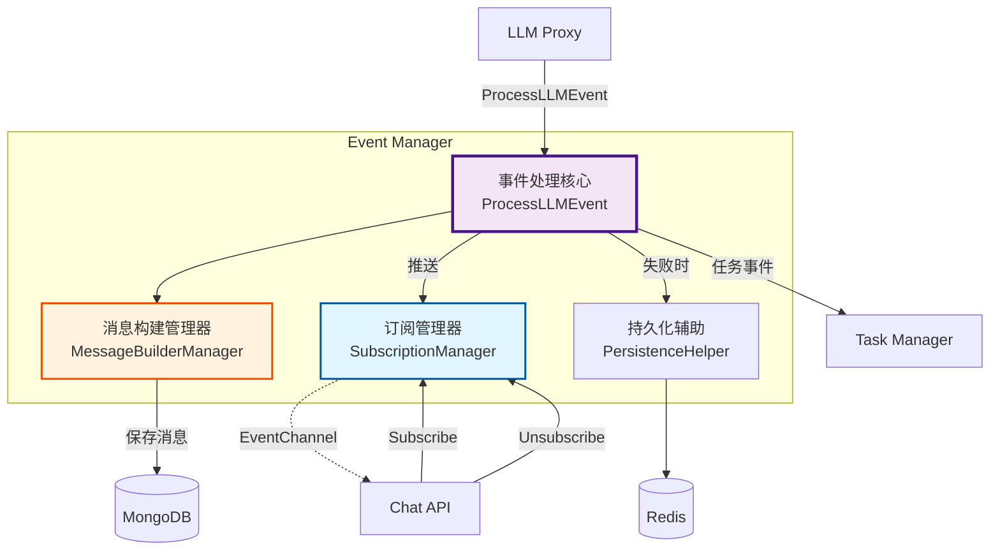

```mermaid
graph TB
    subgraph EventManager[Event Manager]
        direction TB
        SubMgr[订阅管理器<br/>SubscriptionManager]
        BuilderMgr[消息构建管理器<br/>MessageBuilderManager]
        ProcessCore[事件处理核心<br/>ProcessLLMEvent]
        PersistHelper[持久化辅助<br/>PersistenceHelper]
    end
    
    ChatAPI[Chat API] -->|Subscribe| SubMgr
    ChatAPI -->|Unsubscribe| SubMgr
    
    LLMProxy[LLM Proxy] -->|ProcessLLMEvent| ProcessCore
    
    ProcessCore --> BuilderMgr
    ProcessCore -->|推送| SubMgr
    ProcessCore -->|失败时| PersistHelper
    ProcessCore -->|任务事件| TaskMgr[Task Manager]
    
    BuilderMgr -->|保存消息| MongoDB[(MongoDB)]
    PersistHelper --> Redis[(Redis)]
    SubMgr -.->|EventChannel| ChatAPI
    
    style ProcessCore fill:#f3e5f5,stroke:#4a148c,stroke-width:3px
    style BuilderMgr fill:#fff3e0,stroke:#e65100,stroke-width:2px
    style SubMgr fill:#e1f5ff,stroke:#01579b,stroke-width:2px
```