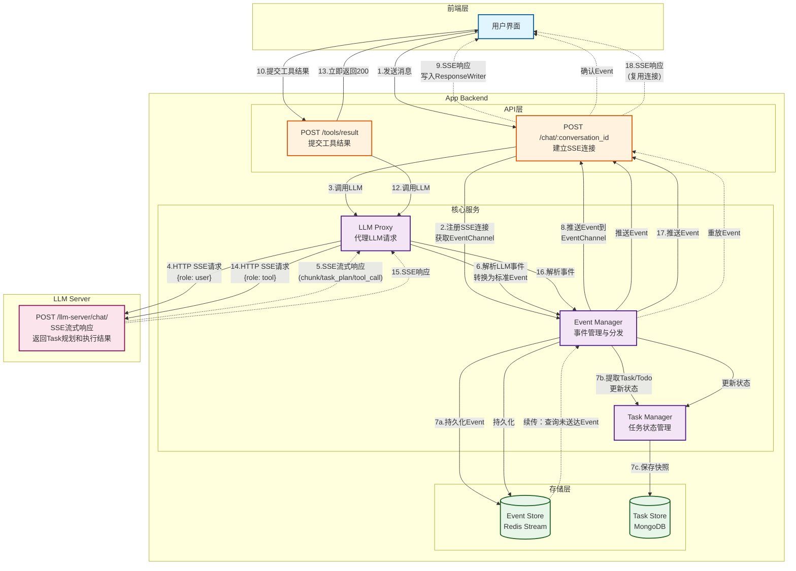

```mermaid
graph TB
    subgraph "前端层"
        UI[用户界面]
    end

    subgraph "App Backend"
        direction TB
        
        subgraph "API层"
            ChatAPI["POST /chat/:conversation_id<br/>建立SSE连接"]
            ToolAPI["POST /tools/result<br/>提交工具结果"]
        end
        
        subgraph "核心服务"
            EventMgr["Event Manager<br/>事件管理与分发"]
            TaskMgr["Task Manager<br/>任务状态管理"]
            LLMProxy["LLM Proxy<br/>代理LLM请求"]
        end
        
        subgraph "存储层"
            EventStore[("Event Store<br/>Redis Stream")]
            TaskStore[("Task Store<br/>MongoDB")]
        end
    end

    subgraph "LLM Server"
        LLMAPI["POST /llm-server/chat/<br/>SSE流式响应<br/>返回Task规划和执行结果"]
    end

    %% ===== 用户发送消息流程 =====
    UI -->|"1.发送消息"| ChatAPI
    ChatAPI -->|"2.注册SSE连接<br/>获取EventChannel"| EventMgr
    ChatAPI -->|"3.调用LLM"| LLMProxy
    
    LLMProxy -->|"4.HTTP SSE请求<br/>{role: user}"| LLMAPI
    LLMAPI -.->|"5.SSE流式响应<br/>(chunk/task_plan/tool_call)"| LLMProxy
    
    LLMProxy -->|"6.解析LLM事件<br/>转换为标准Event"| EventMgr
    EventMgr -->|"7a.持久化Event"| EventStore
    EventMgr -->|"7b.提取Task/Todo<br/>更新状态"| TaskMgr
    TaskMgr -->|"7c.保存快照"| TaskStore
    
    EventMgr -->|"8.推送Event到<br/>EventChannel"| ChatAPI
    ChatAPI -.->|"9.SSE响应<br/>写入ResponseWriter"| UI
    
    %% ===== 工具调用流程 =====
    UI -->|"10.提交工具结果"| ToolAPI
    EventMgr -->|"推送Event"| ChatAPI
    ChatAPI -.->|"确认Event"| UI
    
    ToolAPI -->|"12.调用LLM"| LLMProxy
    ToolAPI -->|"13.立即返回200"| UI
    
    LLMProxy -->|"14.HTTP SSE请求<br/>{role: tool}"| LLMAPI
    LLMAPI -.->|"15.SSE响应"| LLMProxy
    LLMProxy -->|"16.解析事件"| EventMgr
    EventMgr -->|"持久化"| EventStore
    EventMgr -->|"更新状态"| TaskMgr
    EventMgr -->|"17.推送Event"| ChatAPI
    ChatAPI -.->|"18.SSE响应<br/>(复用连接)"| UI
    
    %% ===== 续传 =====
    EventStore -.->|"续传：查询未送达Event"| EventMgr
    EventMgr -.->|"重放Event"| ChatAPI

    classDef frontend fill:#e1f5ff,stroke:#01579b,stroke-width:2px
    classDef api fill:#fff3e0,stroke:#e65100,stroke-width:2px
    classDef service fill:#f3e5f5,stroke:#4a148c,stroke-width:2px
    classDef storage fill:#e8f5e9,stroke:#1b5e20,stroke-width:2px
    classDef llm fill:#fce4ec,stroke:#880e4f,stroke-width:2px
    
    class UI frontend
    class ChatAPI,ToolAPI api
    class EventMgr,TaskMgr,LLMProxy service
    class EventStore,TaskStore storage
    class LLMAPI llm
```