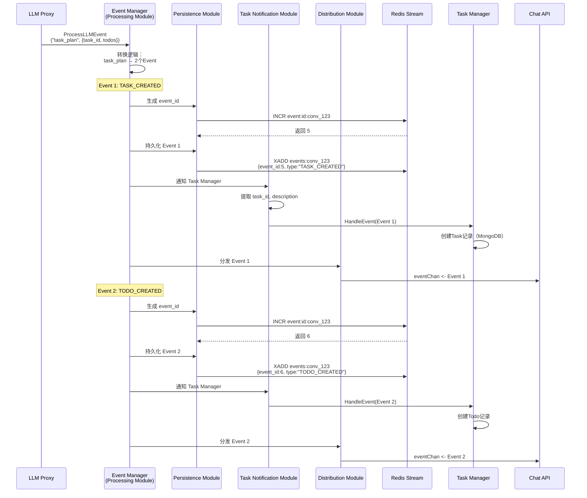

```mermaid
sequenceDiagram
    participant LLMProxy as LLM Proxy
    participant EventProc as Event Manager<br/>(Processing Module)
    participant Persist as Persistence Module
    participant TaskNotif as Task Notification Module
    participant Distrib as Distribution Module
    participant Redis as Redis Stream
    participant TaskMgr as Task Manager
    participant ChatAPI as Chat API

    LLMProxy->>EventProc: ProcessLLMEvent<br/>("task_plan", {task_id, todos})

    EventProc->>EventProc: 转换逻辑：<br/>task_plan → 2个Event
    
    Note over EventProc: Event 1: TASK_CREATED
    EventProc->>Persist: 生成 event_id
    Persist->>Redis: INCR event:id:conv_123
    Redis-->>Persist: 返回 5
    
    EventProc->>Persist: 持久化 Event 1
    Persist->>Redis: XADD events:conv_123<br/>{event_id:5, type:"TASK_CREATED"}
    
    EventProc->>TaskNotif: 通知 Task Manager
    TaskNotif->>TaskNotif: 提取 task_id, description
    TaskNotif->>TaskMgr: HandleEvent(Event 1)
    TaskMgr->>TaskMgr: 创建Task记录（MongoDB）
    
    EventProc->>Distrib: 分发 Event 1
    Distrib->>ChatAPI: eventChan <- Event 1
    
    Note over EventProc: Event 2: TODO_CREATED
    EventProc->>Persist: 生成 event_id
    Persist->>Redis: INCR event:id:conv_123
    Redis-->>Persist: 返回 6
    
    EventProc->>Persist: 持久化 Event 2
    Persist->>Redis: XADD events:conv_123<br/>{event_id:6, type:"TODO_CREATED"}
    
    EventProc->>TaskNotif: 通知 Task Manager
    TaskNotif->>TaskMgr: HandleEvent(Event 2)
    TaskMgr->>TaskMgr: 创建Todo记录
    
    EventProc->>Distrib: 分发 Event 2
    Distrib->>ChatAPI: eventChan <- Event 2
```