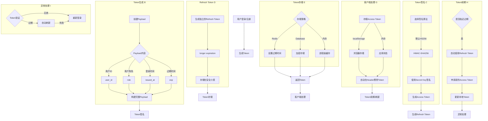

```mermaid
graph TD
    A[用户登录/注册] --> B[生成Token]
    
    subgraph Token生成 B
        B1[创建Payload] --> B2{Payload内容}
        B2 --> |用户ID| B3[user_id]
        B2 --> |用户角色| B4[role]
        B2 --> |登录时间| B5[issued_at]
        B2 --> |过期时间| B6[exp]
        
        B3 --> B7[构建完整Payload]
        B4 --> B7
        B5 --> B7
        B6 --> B7
    end


    B7 --> C[Token签名]
    
    subgraph Token签名 C
        C1[选择签名算法] --> |默认HS256| C2[HMAC-SHA256]
        C2 --> C3[使用Secret Key签名]
        C3 --> C4[生成Access Token]
    end


    C4 --> D[生成Refresh Token]
    
    subgraph Refresh Token D
        D1[生成独立的Refresh Token] --> D2[longer expiration]
        D2 --> D3[存储在安全介质]
    end


    D3 --> E[Token存储]
    
    subgraph Token存储 E
        E1{存储策略} --> |Redis| E2[设置过期时间]
        E1 --> |Database| E3[加密存储]
        E1 --> |内存| E4[进程级缓存]
    end


    E2 --> F[返回Token]
    E3 --> F
    E4 --> F


    F --> G[客户端处理]
    
    subgraph 客户端处理 G
        G1[存储Access Token] --> |localStorage| G2[浏览器存储]
        G1 --> |内存| G3[应用状态]
        G2 --> G4[添加请求拦截器]
        G3 --> G4
        G4[自动在Header携带Token]
    end


    G4 --> H[Token续期/刷新]
    
    subgraph Token续期 H
        H1{是否临近过期} --> |是| H2[自动使用Refresh Token]
        H2 --> H3[申请新的Access Token]
        H3 --> H4[更新本地Token]
    end


    H4 --> I[异常处理]
    
    subgraph 异常处理 I
        I1{Token验证} --> |过期| I2[自动刷新]
        I1 --> |无效| I3[重新登录]
        I2 --> |失败| I3
    end
```