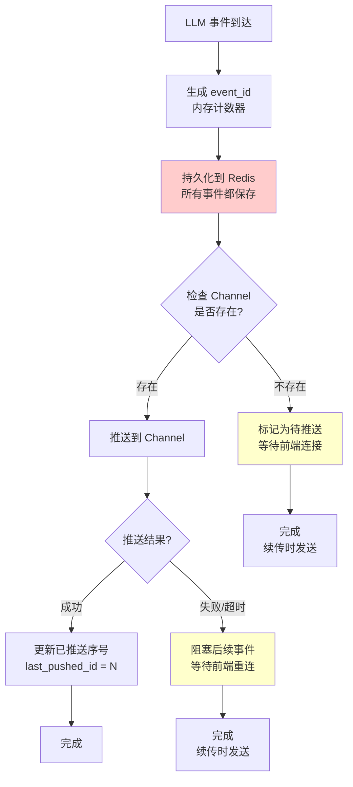

```mermaid
graph TB
    Start[LLM 事件到达]
    
    Start --> Generate[生成 event_id<br/>内存计数器]
    
    Generate --> Persist[持久化到 Redis<br/>所有事件都保存]
    
    Persist --> Check{检查 Channel<br/>是否存在?}
    
    Check -->|存在| TryPush[推送到 Channel]
    Check -->|不存在| MarkPending[标记为待推送<br/>等待前端连接]
    
    TryPush --> PushResult{推送结果?}
    
    PushResult -->|成功| UpdateSeq[更新已推送序号<br/>last_pushed_id = N]
    PushResult -->|失败/超时| Block[阻塞后续事件<br/>等待前端重连]
    
    UpdateSeq --> Done1[完成]
    MarkPending --> Done2[完成<br/>续传时发送]
    Block --> Done3[完成<br/>续传时发送]
    
    style Persist fill:#ffcccc
    style Block fill:#ffffcc
    style MarkPending fill:#ffffcc
```