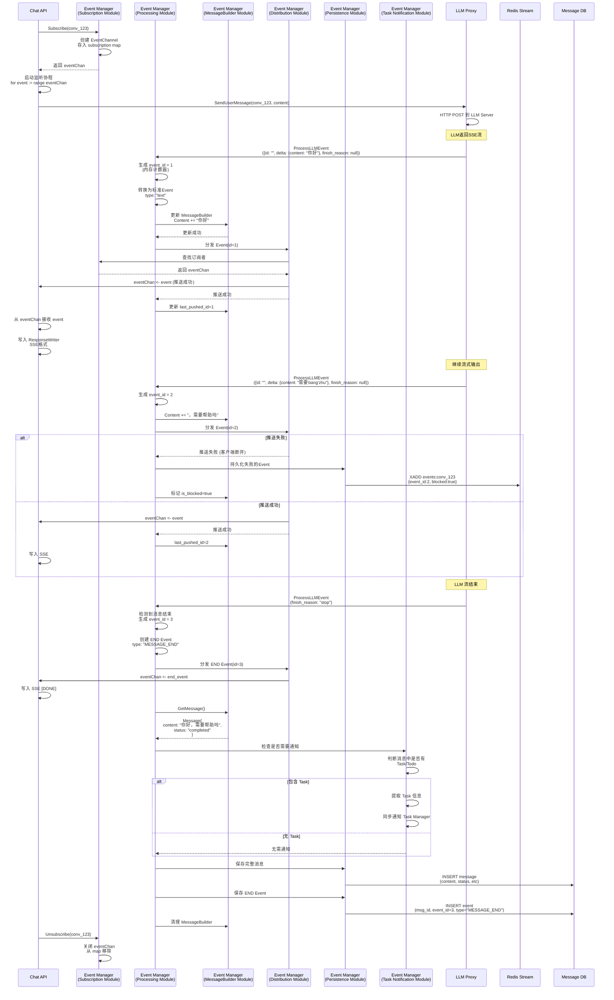

```mermaid
sequenceDiagram
    participant ChatAPI as Chat API
    participant SubMod as Event Manager<br/>(Subscription Module)
    participant ProcMod as Event Manager<br/>(Processing Module)
    participant BuilderMod as Event Manager<br/>(MessageBuilder Module)
    participant DistribMod as Event Manager<br/>(Distribution Module)
    participant PersistMod as Event Manager<br/>(Persistence Module)
    participant TaskNotifMod as Event Manager<br/>(Task Notification Module)
    participant LLMProxy as LLM Proxy
    participant Redis as Redis Stream
    participant MsgDB as Message DB

    ChatAPI->>SubMod: Subscribe(conv_123)
    SubMod->>SubMod: 创建 EventChannel<br/>存入 subscription map
    SubMod-->>ChatAPI: 返回 eventChan

    ChatAPI->>ChatAPI: 启动监听协程<br/>for event := range eventChan
    
    ChatAPI->>LLMProxy: SendUserMessage(conv_123, content)
    LLMProxy->>LLMProxy: HTTP POST 到 LLM Server

    Note over LLMProxy: LLM返回SSE流

    LLMProxy->>ProcMod: ProcessLLMEvent<br/>({id: "", delta: {content: "你好"}, finish_reason: null})
    
    ProcMod->>ProcMod: 生成 event_id = 1<br/>(内存计数器)
    
    ProcMod->>ProcMod: 转换为标准Event<br/>type: "text"
    
    ProcMod->>BuilderMod: 更新 MessageBuilder<br/>Content += "你好"
    BuilderMod-->>ProcMod: 更新成功
    
    ProcMod->>DistribMod: 分发 Event(id=1)
    DistribMod->>SubMod: 查找订阅者
    SubMod-->>DistribMod: 返回 eventChan
    DistribMod->>ChatAPI: eventChan <- event (推送成功)
    DistribMod-->>ProcMod: 推送成功
    
    ProcMod->>BuilderMod: 更新 last_pushed_id=1
    
    ChatAPI->>ChatAPI: 从 eventChan 接收 event
    ChatAPI->>ChatAPI: 写入 ResponseWriter<br/>SSE格式
    
    Note over LLMProxy: 继续流式输出
    
    LLMProxy->>ProcMod: ProcessLLMEvent<br/>({id: "", delta: {content: "需要bang'zhu"}, finish_reason: null})
    ProcMod->>ProcMod: 生成 event_id = 2
    ProcMod->>BuilderMod: Content += "，需要帮助吗"
    ProcMod->>DistribMod: 分发 Event(id=2)
    
    alt 推送失败
        DistribMod-->>ProcMod: 推送失败 (客户端断开)
        ProcMod->>PersistMod: 持久化失败的Event
        PersistMod->>Redis: XADD events:conv_123<br/>{event_id:2, blocked:true}
        ProcMod->>BuilderMod: 标记 is_blocked=true
    else 推送成功
        DistribMod->>ChatAPI: eventChan <- event
        DistribMod-->>ProcMod: 推送成功
        ProcMod->>BuilderMod: last_pushed_id=2
        ChatAPI->>ChatAPI: 写入 SSE
    end
    
    Note over LLMProxy: LLM 流结束
    
    LLMProxy->>ProcMod: ProcessLLMEvent<br/>(finish_reason: "stop")
    
    ProcMod->>ProcMod: 检测到消息结束<br/>生成 event_id = 3
    
    ProcMod->>ProcMod: 创建 END Event<br/>type: "MESSAGE_END"
    
    ProcMod->>DistribMod: 分发 END Event(id=3)
    DistribMod->>ChatAPI: eventChan <- end_event
    
    ChatAPI->>ChatAPI: 写入 SSE [DONE]
    
    ProcMod->>BuilderMod: GetMessage()
    BuilderMod-->>ProcMod: Message{<br/>  content: "你好，需要帮助吗",<br/>  status: "completed"<br/>}
    
    ProcMod->>TaskNotifMod: 检查是否需要通知
    TaskNotifMod->>TaskNotifMod: 判断消息中是否有<br/>Task/Todo
    
    alt 包含 Task
        TaskNotifMod->>TaskNotifMod: 提取 Task 信息
        TaskNotifMod->>TaskNotifMod: 同步通知 Task Manager
    else 无 Task
        TaskNotifMod-->>ProcMod: 无需通知
    end
    
    ProcMod->>PersistMod: 保存完整消息
    PersistMod->>MsgDB: INSERT message<br/>(content, status, etc)
    
    ProcMod->>PersistMod: 保存 END Event
    PersistMod->>MsgDB: INSERT event<br/>(msg_id, event_id=3, type="MESSAGE_END")
    
    ProcMod->>BuilderMod: 清理 MessageBuilder
    
    ChatAPI->>SubMod: Unsubscribe(conv_123)
    SubMod->>SubMod: 关闭 eventChan<br/>从 map 移除
```