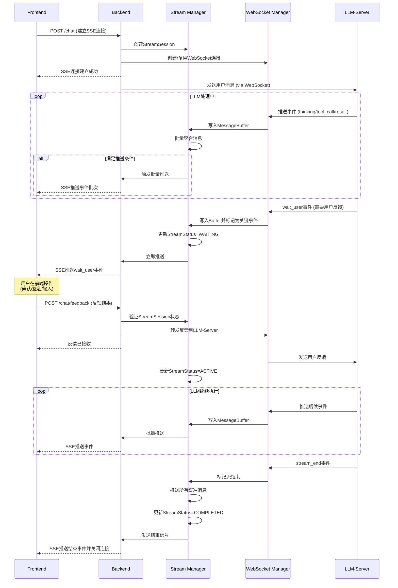

```mermaid
sequenceDiagram
    participant F as Frontend
    participant B as Backend
    participant SM as Stream Manager
    participant WS as WebSocket Manager
    participant L as LLM-Server

    F->>B: POST /chat (建立SSE连接)
    B->>SM: 创建StreamSession
    B->>WS: 创建/复用WebSocket连接
    B-->>F: SSE连接建立成功

    B->>L: 发送用户消息 (via WebSocket)
    
    loop LLM处理中
        L->>WS: 推送事件 (thinking/tool_call/result)
        WS->>SM: 写入MessageBuffer
        SM->>SM: 批量聚合消息
        
        alt 满足推送条件
            SM->>B: 触发批量推送
            B-->>F: SSE推送事件批次
        end
    end
    
    L->>WS: wait_user事件 (需要用户反馈)
    WS->>SM: 写入Buffer并标记为关键事件
    SM->>SM: 更新StreamStatus=WAITING
    SM->>B: 立即推送
    B-->>F: SSE推送wait_user事件
    
    Note over F: 用户在前端操作<br/>(确认/签名/输入)
    
    F->>B: POST /chat/feedback (反馈结果)
    B->>SM: 验证StreamSession状态
    B->>WS: 转发反馈到LLM-Server
    B-->>F: 反馈已接收
    
    WS->>L: 发送用户反馈
    SM->>SM: 更新StreamStatus=ACTIVE
    
    loop LLM继续执行
        L->>WS: 推送后续事件
        WS->>SM: 写入MessageBuffer
        SM->>B: 批量推送
        B-->>F: SSE推送事件
    end
    
    L->>WS: stream_end事件
    WS->>SM: 标记流结束
    SM->>SM: 推送所有缓冲消息
    SM->>SM: 更新StreamStatus=COMPLETED
    SM->>B: 发送结束信号
    B-->>F: SSE推送结束事件并关闭连接
```