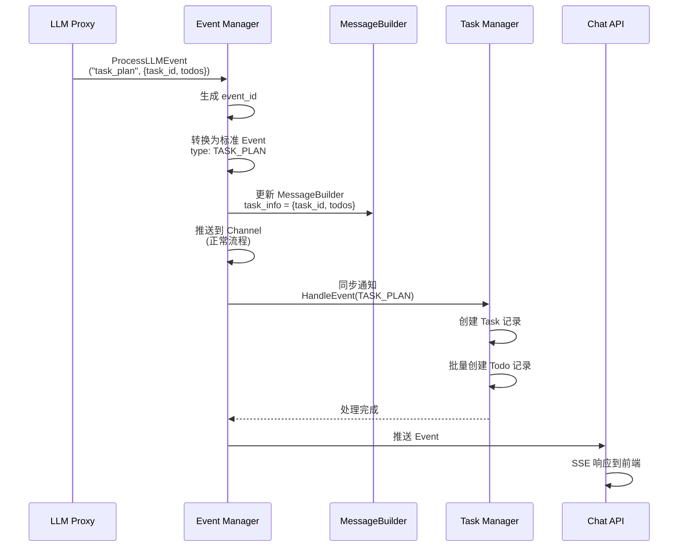

```mermaid
sequenceDiagram
    participant LLMProxy as LLM Proxy
    participant EventMgr as Event Manager
    participant Builder as MessageBuilder
    participant TaskMgr as Task Manager
    participant ChatAPI as Chat API

    LLMProxy->>EventMgr: ProcessLLMEvent<br/>("task_plan", {task_id, todos})

    EventMgr->>EventMgr: 生成 event_id
    EventMgr->>EventMgr: 转换为标准 Event<br/>type: TASK_PLAN
    
    EventMgr->>Builder: 更新 MessageBuilder<br/>task_info = {task_id, todos}
    
    EventMgr->>EventMgr: 推送到 Channel<br/>(正常流程)
    
    EventMgr->>TaskMgr: 同步通知<br/>HandleEvent(TASK_PLAN)
    TaskMgr->>TaskMgr: 创建 Task 记录
    TaskMgr->>TaskMgr: 批量创建 Todo 记录
    TaskMgr-->>EventMgr: 处理完成
    
    EventMgr->>ChatAPI: 推送 Event
    ChatAPI->>ChatAPI: SSE 响应到前端
```