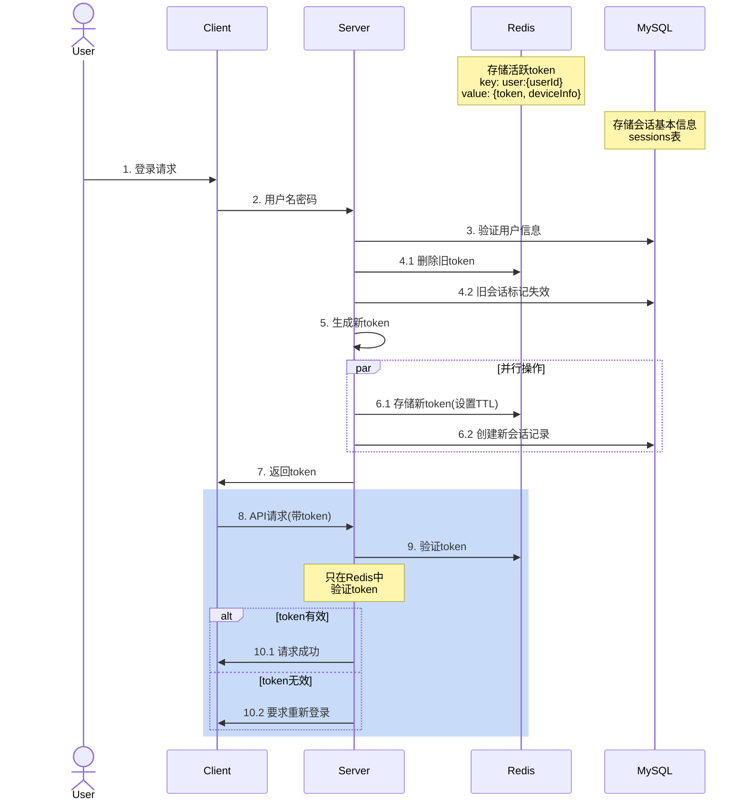

```mermaid
sequenceDiagram
    actor User
    participant Client
    participant Server
    participant Redis
    participant MySQL

    Note over Redis: 存储活跃token<br/>key: user:{userId}<br/>value: {token, deviceInfo}
    Note over MySQL: 存储会话基本信息<br/>sessions表

    %% 登录流程
    User->>Client: 1. 登录请求
    Client->>Server: 2. 用户名密码
    Server->>MySQL: 3. 验证用户信息
    
    %% 处理旧会话
    Server->>Redis: 4.1 删除旧token
    Server->>MySQL: 4.2 旧会话标记失效
    
    %% 创建新会话
    Server->>Server: 5. 生成新token
    par 并行操作
        Server->>Redis: 6.1 存储新token(设置TTL)
        Server->>MySQL: 6.2 创建新会话记录
    end
    
    Server->>Client: 7. 返回token
    
    %% API调用验证流程
    rect rgb(200, 220, 250)
        Client->>Server: 8. API请求(带token)
        Server->>Redis: 9. 验证token
        Note over Server: 只在Redis中<br/>验证token
        
        alt token有效
            Server->>Client: 10.1 请求成功
        else token无效
            Server->>Client: 10.2 要求重新登录
        end
    end
```