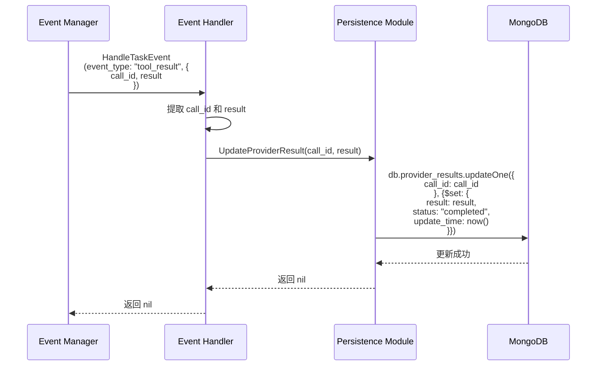

```mermaid
sequenceDiagram
    participant EM as Event Manager
    participant EH as Event Handler
    participant Persist as Persistence Module
    participant DB as MongoDB

    EM->>EH: HandleTaskEvent<br/>(event_type: "tool_result", {<br/>  call_id, result<br/>})
    
    EH->>EH: 提取 call_id 和 result
    
    EH->>Persist: UpdateProviderResult(call_id, result)
    Persist->>DB: db.provider_results.updateOne({<br/>  call_id: call_id<br/>}, {$set: {<br/>  result: result,<br/>  status: "completed",<br/>  update_time: now()<br/>}})
    DB-->>Persist: 更新成功
    
    Persist-->>EH: 返回 nil
    EH-->>EM: 返回 nil
```