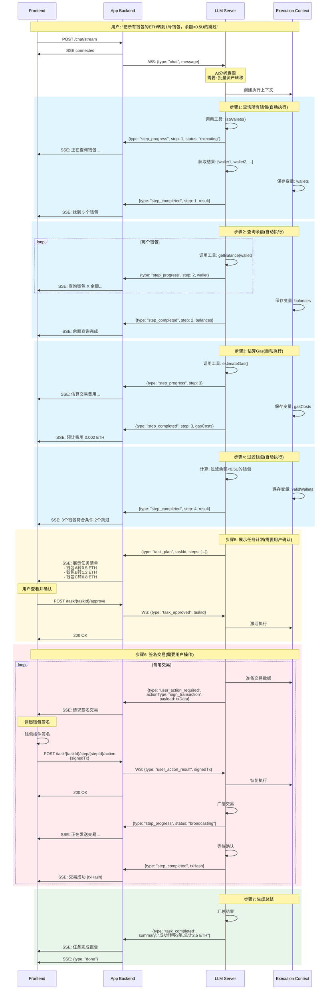

```mermaid
sequenceDiagram
    participant F as Frontend
    participant A as App Backend
    participant L as LLM Server
    participant Ctx as Execution Context

    Note over F,Ctx: 用户: "把所有钱包的ETH转到1号钱包，余额<0.5U的跳过"
    
    F->>A: POST /chat/stream
    A->>F: SSE connected
    A->>L: WS: {type: "chat", message}
    
    Note over L: AI分析意图<br/>需要: 批量资产转移
    L->>Ctx: 创建执行上下文
    
    rect rgb(225, 245, 255)
        Note over L,Ctx: 步骤1: 查询所有钱包(自动执行)
        L->>L: 调用工具: listWallets()
        L->>A: {type: "step_progress", step: 1, status: "executing"}
        A->>F: SSE: 正在查询钱包...
        L->>L: 获取结果: [wallet1, wallet2, ...]
        Ctx->>Ctx: 保存变量: wallets
        L->>A: {type: "step_completed", step: 1, result}
        A->>F: SSE: 找到 5 个钱包
    end
    
    rect rgb(225, 245, 255)
        Note over L,Ctx: 步骤2: 查询余额(自动执行)
        loop 每个钱包
            L->>L: 调用工具: getBalance(wallet)
            L->>A: {type: "step_progress", step: 2, wallet}
            A->>F: SSE: 查询钱包 X 余额...
        end
        Ctx->>Ctx: 保存变量: balances
        L->>A: {type: "step_completed", step: 2, balances}
        A->>F: SSE: 余额查询完成
    end
    
    rect rgb(225, 245, 255)
        Note over L,Ctx: 步骤3: 估算Gas(自动执行)
        L->>L: 调用工具: estimateGas()
        L->>A: {type: "step_progress", step: 3}
        A->>F: SSE: 估算交易费用...
        Ctx->>Ctx: 保存变量: gasCosts
        L->>A: {type: "step_completed", step: 3, gasCosts}
        A->>F: SSE: 预计费用 0.002 ETH
    end
    
    rect rgb(225, 245, 255)
        Note over L,Ctx: 步骤4: 过滤钱包(自动执行)
        L->>L: 计算: 过滤余额<0.5U的钱包
        Ctx->>Ctx: 保存变量: validWallets
        L->>A: {type: "step_completed", step: 4, result}
        A->>F: SSE: 3个钱包符合条件,2个跳过
    end
    
    rect rgb(255, 249, 225)
        Note over L,Ctx: 步骤5: 展示任务计划(需要用户确认)
        L->>A: {type: "task_plan", taskId, steps: [...]}
        A->>F: SSE: 展示任务清单<br/>- 钱包A转0.5 ETH<br/>- 钱包B转1.2 ETH<br/>- 钱包C转0.8 ETH
        
        Note over F: 用户查看并确认
        F->>A: POST /task/{taskId}/approve
        A->>L: WS: {type: "task_approved", taskId}
        L->>Ctx: 激活执行
        A->>F: 200 OK
    end
    
    rect rgb(255, 235, 238)
        Note over F,Ctx: 步骤6: 签名交易(需要用户操作)
        loop 每笔交易
            L->>Ctx: 准备交易数据
            L->>A: {type: "user_action_required",<br/>actionType: "sign_transaction",<br/>payload: txData}
            A->>F: SSE: 请求签名交易
            
            Note over F: 调起钱包签名
            F->>F: 钱包插件签名
            F->>A: POST /task/{taskId}/step/{stepId}/action<br/>{signedTx}
            A->>L: WS: {type: "user_action_result", signedTx}
            L->>Ctx: 恢复执行
            A->>F: 200 OK
            
            L->>L: 广播交易
            L->>A: {type: "step_progress", status: "broadcasting"}
            A->>F: SSE: 正在发送交易...
            
            L->>L: 等待确认
            L->>A: {type: "step_completed", txHash}
            A->>F: SSE: 交易成功 {txHash}
        end
    end
    
    rect rgb(232, 245, 233)
        Note over L,Ctx: 步骤7: 生成总结
        L->>L: 汇总结果
        L->>A: {type: "task_completed",<br/>summary: "成功转移3笔,总计2.5 ETH"}
        A->>F: SSE: 任务完成报告
        A->>F: SSE: {type: "done"}
    end
```