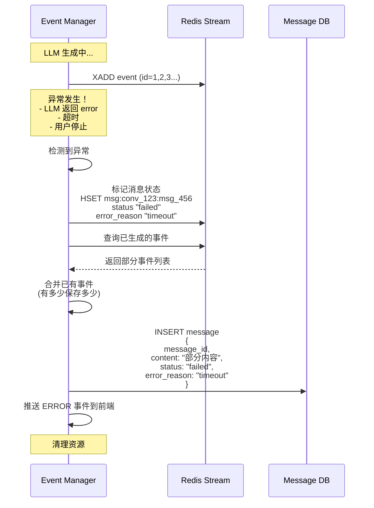

```mermaid
sequenceDiagram
    participant EM as Event Manager
    participant Redis as Redis Stream
    participant MsgDB as Message DB
    
    Note over EM: LLM 生成中...
    
    EM->>Redis: XADD event (id=1,2,3...)
    
    Note over EM: 异常发生！<br/>- LLM 返回 error<br/>- 超时<br/>- 用户停止
    
    EM->>EM: 检测到异常
    EM->>Redis: 标记消息状态<br/>HSET msg:conv_123:msg_456<br/>status "failed"<br/>error_reason "timeout"
    
    EM->>Redis: 查询已生成的事件
    Redis-->>EM: 返回部分事件列表
    
    EM->>EM: 合并已有事件<br/>(有多少保存多少)
    
    EM->>MsgDB: INSERT message<br/>{<br/>  message_id,<br/>  content: "部分内容",<br/>  status: "failed",<br/>  error_reason: "timeout"<br/>}
    
    EM->>EM: 推送 ERROR 事件到前端
    
    Note over EM: 清理资源
```