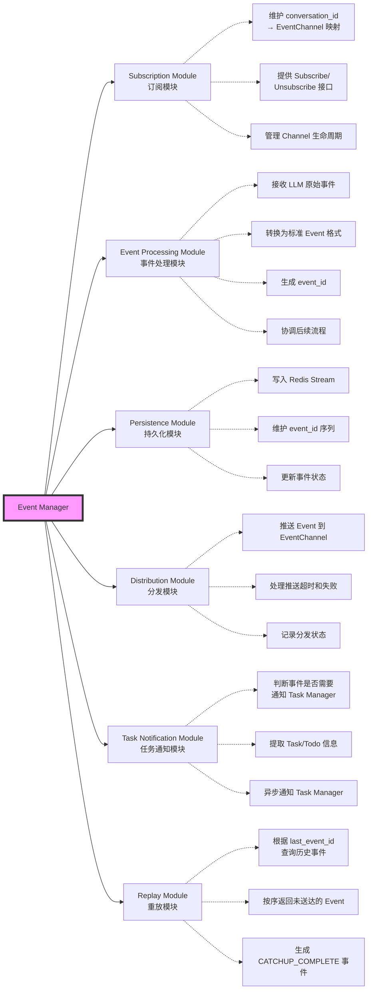

```mermaid
graph LR
    EM[Event Manager]
    
    EM --> SM[Subscription Module<br/>订阅模块]
    EM --> EPM[Event Processing Module<br/>事件处理模块]
    EM --> PM[Persistence Module<br/>持久化模块]
    EM --> DM[Distribution Module<br/>分发模块]
    EM --> TNM[Task Notification Module<br/>任务通知模块]
    EM --> RM[Replay Module<br/>重放模块]
    
    SM -.-> SM1[维护 conversation_id<br/>→ EventChannel 映射]
    SM -.-> SM2[提供 Subscribe/<br/>Unsubscribe 接口]
    SM -.-> SM3[管理 Channel 生命周期]
    
    EPM -.-> EPM1[接收 LLM 原始事件]
    EPM -.-> EPM2[转换为标准 Event 格式]
    EPM -.-> EPM3[生成 event_id]
    EPM -.-> EPM4[协调后续流程]
    
    PM -.-> PM1[写入 Redis Stream]
    PM -.-> PM2[维护 event_id 序列]
    PM -.-> PM3[更新事件状态]
    
    DM -.-> DM1[推送 Event 到 EventChannel]
    DM -.-> DM2[处理推送超时和失败]
    DM -.-> DM3[记录分发状态]
    
    TNM -.-> TNM1[判断事件是否需要<br/>通知 Task Manager]
    TNM -.-> TNM2[提取 Task/Todo 信息]
    TNM -.-> TNM3[异步通知 Task Manager]
    
    RM -.-> RM1[根据 last_event_id<br/>查询历史事件]
    RM -.-> RM2[按序返回未送达的 Event]
    RM -.-> RM3[生成 CATCHUP_COMPLETE 事件]
    
    style EM fill:#f9f,stroke:#333,stroke-width:4px
```