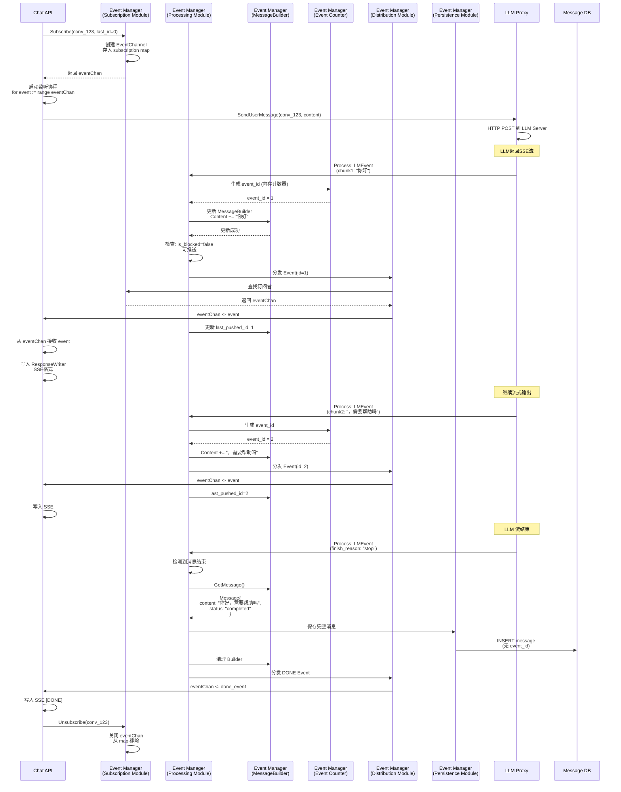

```mermaid
sequenceDiagram
    participant ChatAPI as Chat API
    participant SubMod as Event Manager<br/>(Subscription Module)
    participant ProcMod as Event Manager<br/>(Processing Module)
    participant Builder as Event Manager<br/>(MessageBuilder)
    participant Counter as Event Manager<br/>(Event Counter)
    participant DistribMod as Event Manager<br/>(Distribution Module)
    participant PersistMod as Event Manager<br/>(Persistence Module)
    participant LLMProxy as LLM Proxy
    participant MsgDB as Message DB

    ChatAPI->>SubMod: Subscribe(conv_123, last_id=0)
    SubMod->>SubMod: 创建 EventChannel<br/>存入 subscription map
    SubMod-->>ChatAPI: 返回 eventChan

    ChatAPI->>ChatAPI: 启动监听协程<br/>for event := range eventChan
    
    ChatAPI->>LLMProxy: SendUserMessage(conv_123, content)
    LLMProxy->>LLMProxy: HTTP POST 到 LLM Server

    Note over LLMProxy: LLM返回SSE流

    LLMProxy->>ProcMod: ProcessLLMEvent<br/>(chunk1: "你好")
    
    ProcMod->>Counter: 生成 event_id (内存计数器)
    Counter-->>ProcMod: event_id = 1
    
    ProcMod->>Builder: 更新 MessageBuilder<br/>Content += "你好"
    Builder-->>ProcMod: 更新成功
    
    ProcMod->>ProcMod: 检查: is_blocked=false<br/>可推送
    
    ProcMod->>DistribMod: 分发 Event(id=1)
    DistribMod->>SubMod: 查找订阅者
    SubMod-->>DistribMod: 返回 eventChan
    DistribMod->>ChatAPI: eventChan <- event
    
    ProcMod->>Builder: 更新 last_pushed_id=1
    
    ChatAPI->>ChatAPI: 从 eventChan 接收 event
    ChatAPI->>ChatAPI: 写入 ResponseWriter<br/>SSE格式
    
    Note over LLMProxy: 继续流式输出
    
    LLMProxy->>ProcMod: ProcessLLMEvent<br/>(chunk2: "，需要帮助吗")
    ProcMod->>Counter: 生成 event_id
    Counter-->>ProcMod: event_id = 2
    ProcMod->>Builder: Content += "，需要帮助吗"
    ProcMod->>DistribMod: 分发 Event(id=2)
    DistribMod->>ChatAPI: eventChan <- event
    ProcMod->>Builder: last_pushed_id=2
    
    ChatAPI->>ChatAPI: 写入 SSE
    
    Note over LLMProxy: LLM 流结束
    
    LLMProxy->>ProcMod: ProcessLLMEvent<br/>(finish_reason: "stop")
    
    ProcMod->>ProcMod: 检测到消息结束
    ProcMod->>Builder: GetMessage()
    Builder-->>ProcMod: Message{<br/>  content: "你好，需要帮助吗",<br/>  status: "completed"<br/>}
    
    ProcMod->>PersistMod: 保存完整消息
    PersistMod->>MsgDB: INSERT message<br/>(无 event_id)
    
    ProcMod->>Builder: 清理 Builder
    
    ProcMod->>DistribMod: 分发 DONE Event
    DistribMod->>ChatAPI: eventChan <- done_event
    
    ChatAPI->>ChatAPI: 写入 SSE [DONE]
    ChatAPI->>SubMod: Unsubscribe(conv_123)
    SubMod->>SubMod: 关闭 eventChan<br/>从 map 移除
```