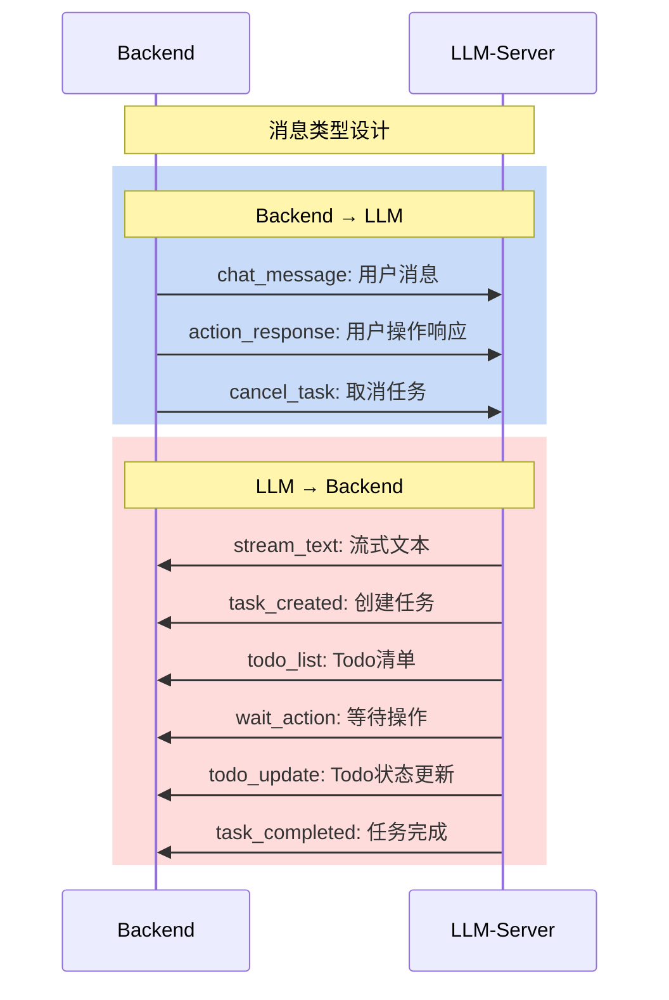

```mermaid
sequenceDiagram
    participant B as Backend
    participant L as LLM-Server
    
    Note over B,L: 消息类型设计
    
    rect rgb(200, 220, 250)
    Note over B,L: Backend → LLM
    B->>L: chat_message: 用户消息
    B->>L: action_response: 用户操作响应
    B->>L: cancel_task: 取消任务
    end
    
    rect rgb(255, 220, 220)
    Note over B,L: LLM → Backend
    L->>B: stream_text: 流式文本
    L->>B: task_created: 创建任务
    L->>B: todo_list: Todo清单
    L->>B: wait_action: 等待操作
    L->>B: todo_update: Todo状态更新
    L->>B: task_completed: 任务完成
    end
```