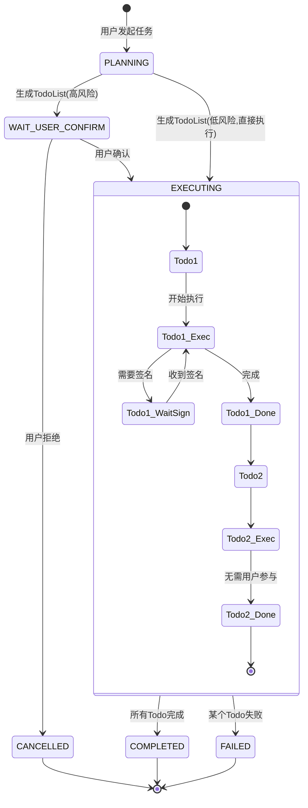

```mermaid
stateDiagram-v2
    [*] --> PLANNING: 用户发起任务
    PLANNING --> WAIT_USER_CONFIRM: 生成TodoList(高风险)
    PLANNING --> EXECUTING: 生成TodoList(低风险,直接执行)
    
    WAIT_USER_CONFIRM --> EXECUTING: 用户确认
    WAIT_USER_CONFIRM --> CANCELLED: 用户拒绝
    
    state EXECUTING {
        [*] --> Todo1
        Todo1 --> Todo1_Exec: 开始执行
        Todo1_Exec --> Todo1_WaitSign: 需要签名
        Todo1_WaitSign --> Todo1_Exec: 收到签名
        Todo1_Exec --> Todo1_Done: 完成
        
        Todo1_Done --> Todo2
        Todo2 --> Todo2_Exec
        Todo2_Exec --> Todo2_Done: 无需用户参与
        
        Todo2_Done --> [*]
    }
    
    EXECUTING --> COMPLETED: 所有Todo完成
    EXECUTING --> FAILED: 某个Todo失败
    CANCELLED --> [*]
    COMPLETED --> [*]
    FAILED --> [*]
```