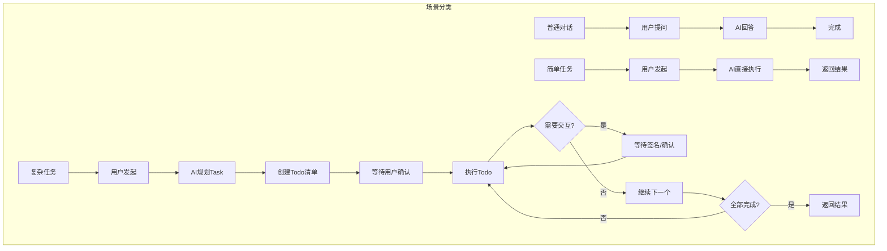

```mermaid
graph TB
    subgraph "场景分类"
        A[普通对话] --> A1[用户提问]
        A1 --> A2[AI回答]
        A2 --> A3[完成]
        
        B[简单任务] --> B1[用户发起]
        B1 --> B2[AI直接执行]
        B2 --> B3[返回结果]
        
        C[复杂任务] --> C1[用户发起]
        C1 --> C2[AI规划Task]
        C2 --> C3[创建Todo清单]
        C3 --> C4[等待用户确认]
        C4 --> C5[执行Todo]
        C5 --> C6{需要交互?}
        C6 -->|是| C7[等待签名/确认]
        C7 --> C5
        C6 -->|否| C8[继续下一个]
        C8 --> C9{全部完成?}
        C9 -->|否| C5
        C9 -->|是| C10[返回结果]
    end
```