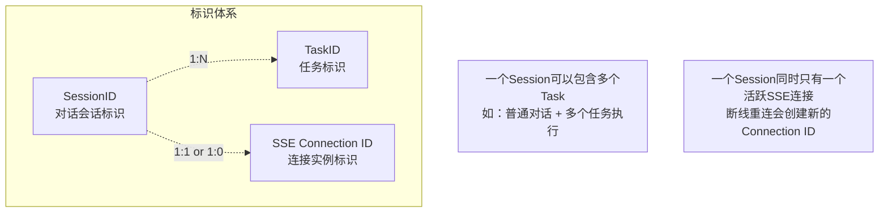

```mermaid
graph TB
    subgraph "标识体系"
        SessionID[SessionID<br/>对话会话标识]
        TaskID[TaskID<br/>任务标识]
        SSEConnID[SSE Connection ID<br/>连接实例标识]
    end
    
    SessionID -.1:N.-> TaskID
    SessionID -.1:1 or 1:0.-> SSEConnID
    
    note1[一个Session可以包含多个Task<br/>如：普通对话 + 多个任务执行]
    note2[一个Session同时只有一个活跃SSE连接<br/>断线重连会创建新的Connection ID]
```