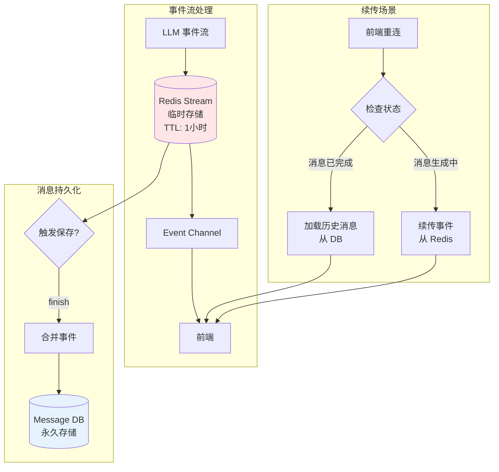

```mermaid
graph TB
    subgraph "事件流处理"
        LLM[LLM 事件流]
        Redis[(Redis Stream<br/>临时存储<br/>TTL: 1小时)]
        Channel[Event Channel]
        
        LLM --> Redis
        Redis --> Channel
        Channel --> FE[前端]
    end
    
    subgraph "消息持久化"
        Trigger{触发保存?}
        Merge[合并事件]
        DB[(Message DB<br/>永久存储)]
        
        Redis --> Trigger
        Trigger -->|finish| Merge
        Merge --> DB
    end
    
    subgraph "续传场景"
        Reconnect[前端重连]
        Check{检查状态}
        
        Reconnect --> Check
        Check -->|消息已完成| LoadHistory[加载历史消息<br/>从 DB]
        Check -->|消息生成中| LoadEvents[续传事件<br/>从 Redis]
        
        LoadHistory --> FE
        LoadEvents --> FE
    end
    
    style Redis fill:#ffe6e6
    style DB fill:#e6f3ff
```