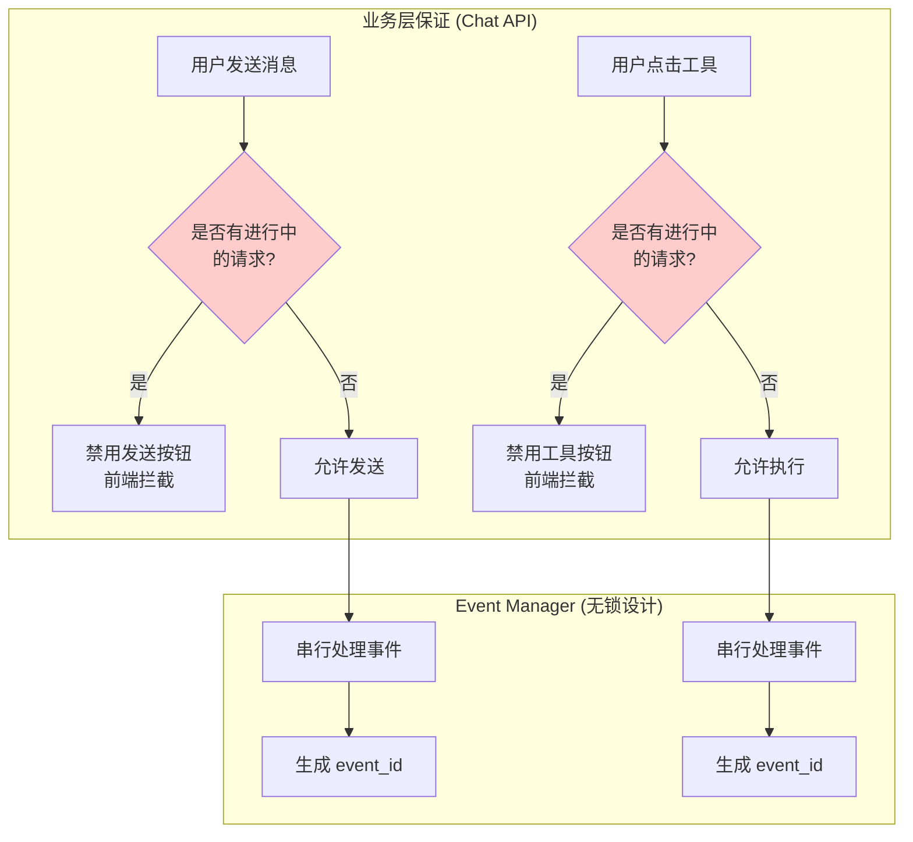

```mermaid
graph TB
    subgraph "业务层保证 (Chat API)"
        UI1[用户发送消息]
        UI2[用户点击工具]
        
        UI1 --> Check1{是否有进行中<br/>的请求?}
        UI2 --> Check2{是否有进行中<br/>的请求?}
        
        Check1 -->|是| Block1[禁用发送按钮<br/>前端拦截]
        Check1 -->|否| Allow1[允许发送]
        
        Check2 -->|是| Block2[禁用工具按钮<br/>前端拦截]
        Check2 -->|否| Allow2[允许执行]
    end
    
    subgraph "Event Manager (无锁设计)"
        Allow1 --> Process1[串行处理事件]
        Allow2 --> Process2[串行处理事件]
        
        Process1 --> Gen1[生成 event_id]
        Process2 --> Gen2[生成 event_id]
    end
    
    style Check1 fill:#ffcccc
    style Check2 fill:#ffcccc
```