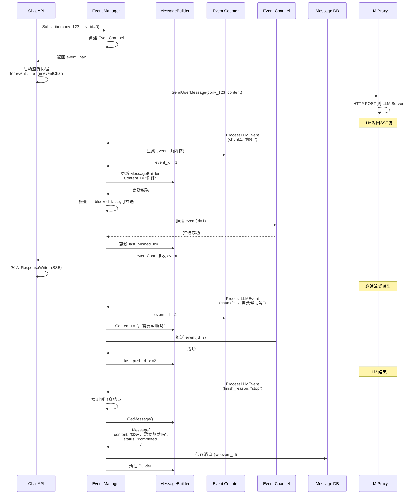

```mermaid
sequenceDiagram
    participant ChatAPI as Chat API
    participant EventMgr as Event Manager
    participant Builder as MessageBuilder
    participant Counter as Event Counter
    participant CH as Event Channel
    participant MsgDB as Message DB
    participant LLMProxy as LLM Proxy

    ChatAPI->>EventMgr: Subscribe(conv_123, last_id=0)
    EventMgr->>EventMgr: 创建 EventChannel
    EventMgr-->>ChatAPI: 返回 eventChan

    ChatAPI->>ChatAPI: 启动监听协程<br/>for event := range eventChan
    
    ChatAPI->>LLMProxy: SendUserMessage(conv_123, content)
    LLMProxy->>LLMProxy: HTTP POST 到 LLM Server

    Note over LLMProxy: LLM返回SSE流

    LLMProxy->>EventMgr: ProcessLLMEvent<br/>(chunk1: "你好")
    
    EventMgr->>Counter: 生成 event_id (内存)
    Counter-->>EventMgr: event_id = 1
    
    EventMgr->>Builder: 更新 MessageBuilder<br/>Content += "你好"
    Builder-->>EventMgr: 更新成功
    
    EventMgr->>EventMgr: 检查: is_blocked=false,可推送
    
    EventMgr->>CH: 推送 event(id=1)
    CH-->>EventMgr: 推送成功
    
    EventMgr->>Builder: 更新 last_pushed_id=1
    
    CH->>ChatAPI: eventChan 接收 event
    ChatAPI->>ChatAPI: 写入 ResponseWriter (SSE)
    
    Note over LLMProxy: 继续流式输出
    
    LLMProxy->>EventMgr: ProcessLLMEvent<br/>(chunk2: "，需要帮助吗")
    EventMgr->>Counter: event_id = 2
    EventMgr->>Builder: Content += "，需要帮助吗"
    EventMgr->>CH: 推送 event(id=2)
    CH-->>EventMgr: 成功
    EventMgr->>Builder: last_pushed_id=2
    
    Note over LLMProxy: LLM 结束
    
    LLMProxy->>EventMgr: ProcessLLMEvent<br/>(finish_reason: "stop")
    
    EventMgr->>EventMgr: 检测到消息结束
    EventMgr->>Builder: GetMessage()
    Builder-->>EventMgr: Message{<br/>  content: "你好，需要帮助吗",<br/>  status: "completed"<br/>}
    
    EventMgr->>MsgDB: 保存消息 (无 event_id)
    EventMgr->>Builder: 清理 Builder
```