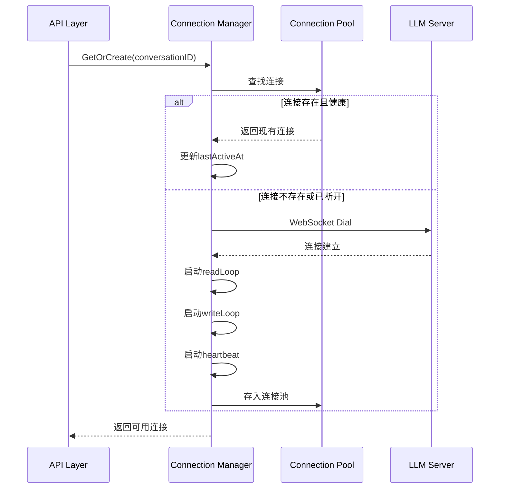

```mermaid
sequenceDiagram
    participant API as API Layer
    participant ConnMgr as Connection Manager
    participant Pool as Connection Pool
    participant LLM as LLM Server
    
    API->>ConnMgr: GetOrCreate(conversationID)
    ConnMgr->>Pool: 查找连接
    
    alt 连接存在且健康
        Pool-->>ConnMgr: 返回现有连接
        ConnMgr->>ConnMgr: 更新lastActiveAt
    else 连接不存在或已断开
        ConnMgr->>LLM: WebSocket Dial
        LLM-->>ConnMgr: 连接建立
        ConnMgr->>ConnMgr: 启动readLoop
        ConnMgr->>ConnMgr: 启动writeLoop
        ConnMgr->>ConnMgr: 启动heartbeat
        ConnMgr->>Pool: 存入连接池
    end
    
    ConnMgr-->>API: 返回可用连接
```