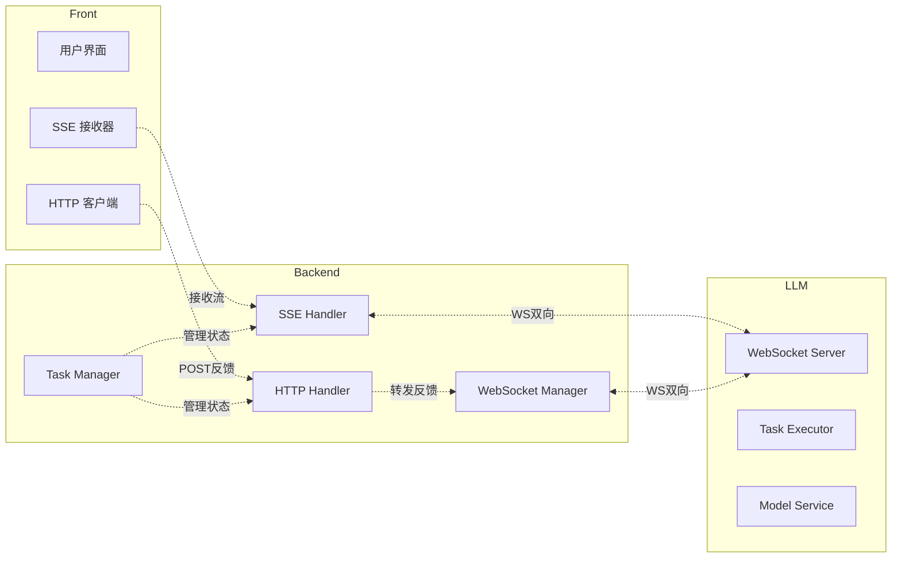

```mermaid
graph LR
    subgraph Front
        F1[用户界面]
        F2[SSE 接收器]
        F3[HTTP 客户端]
    end
    
    subgraph Backend
        B1[SSE Handler]
        B2[HTTP Handler]
        B3[WebSocket Manager]
        B4[Task Manager]
    end
    
    subgraph LLM
        L1[WebSocket Server]
        L2[Task Executor]
        L3[Model Service]
    end
    
    F2 -.接收流.-> B1
    F3 -.POST反馈.-> B2
    B1 <-.WS双向.-> L1
    B2 -.转发反馈.-> B3
    B3 <-.WS双向.-> L1
    B4 -.管理状态.-> B1
    B4 -.管理状态.-> B2
```