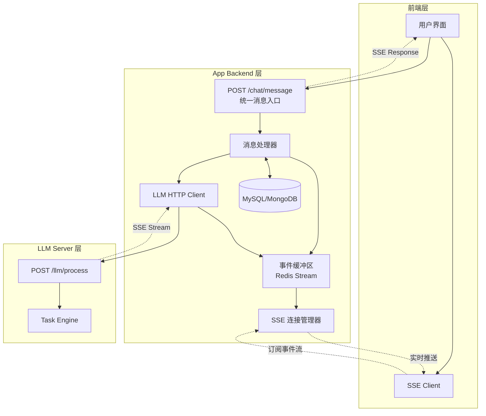

```mermaid
graph TB
    subgraph "前端层"
        UI[用户界面]
        SSE[SSE Client]
    end

    subgraph "App Backend 层"
        direction TB
        Chat_API[POST /chat/message<br/>统一消息入口]
        SSE_Manager[SSE 连接管理器]
        Event_Buffer[事件缓冲区<br/>Redis Stream]
        Message_Handler[消息处理器]
        LLM_Client[LLM HTTP Client]
        DB[(MySQL/MongoDB)]
    end

    subgraph "LLM Server 层"
        LLM_API[POST /llm/process]
        Engine[Task Engine]
    end

    UI --> Chat_API
    UI --> SSE
    
    Chat_API -.SSE Response.-> UI
    SSE -.订阅事件流.-> SSE_Manager
    
    Chat_API --> Message_Handler
    Message_Handler --> Event_Buffer
    Message_Handler --> LLM_Client
    Message_Handler <--> DB
    
    Event_Buffer --> SSE_Manager
    SSE_Manager -.实时推送.-> SSE
    
    LLM_Client --> LLM_API
    LLM_API -.SSE Stream.-> LLM_Client
    LLM_Client --> Event_Buffer
    
    LLM_API --> Engine

```