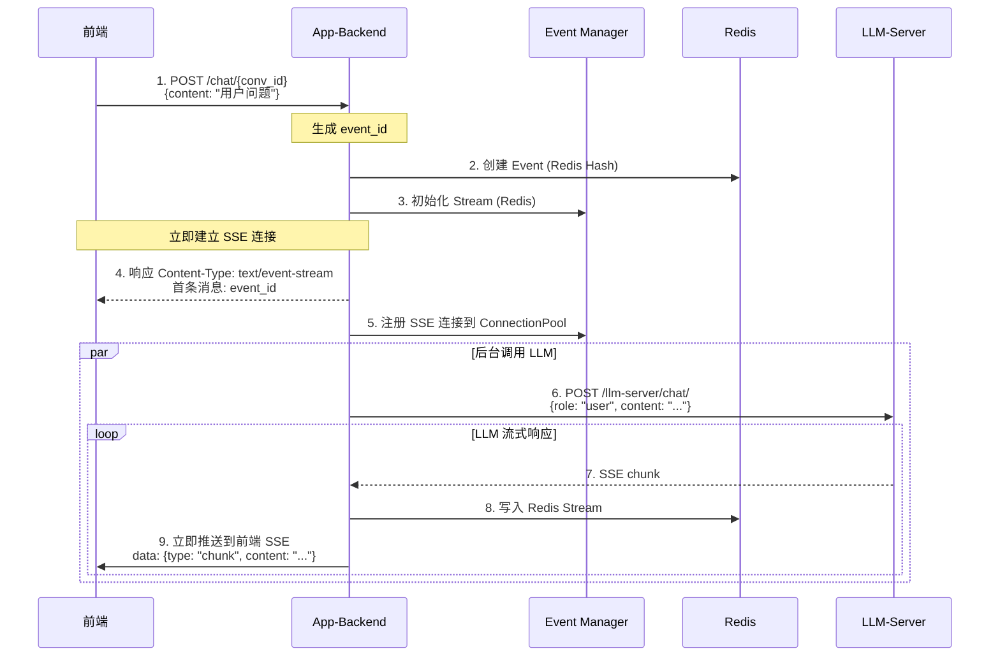

```mermaid
sequenceDiagram
    participant F as 前端
    participant B as App-Backend
    participant E as Event Manager
    participant R as Redis
    participant L as LLM-Server

    F->>B: 1. POST /chat/{conv_id}<br/>{content: "用户问题"}
    
    Note over B: 生成 event_id
    
    B->>R: 2. 创建 Event (Redis Hash)
    B->>E: 3. 初始化 Stream (Redis)
    
    Note over B,F: 立即建立 SSE 连接
    B-->>F: 4. 响应 Content-Type: text/event-stream<br/>首条消息: event_id
    
    B->>E: 5. 注册 SSE 连接到 ConnectionPool
    
    par 后台调用 LLM
        B->>L: 6. POST /llm-server/chat/<br/>{role: "user", content: "..."}
        
        loop LLM 流式响应
            L-->>B: 7. SSE chunk
            B->>R: 8. 写入 Redis Stream
            B->>F: 9. 立即推送到前端 SSE<br/>data: {type: "chunk", content: "..."}
        end
    end
```