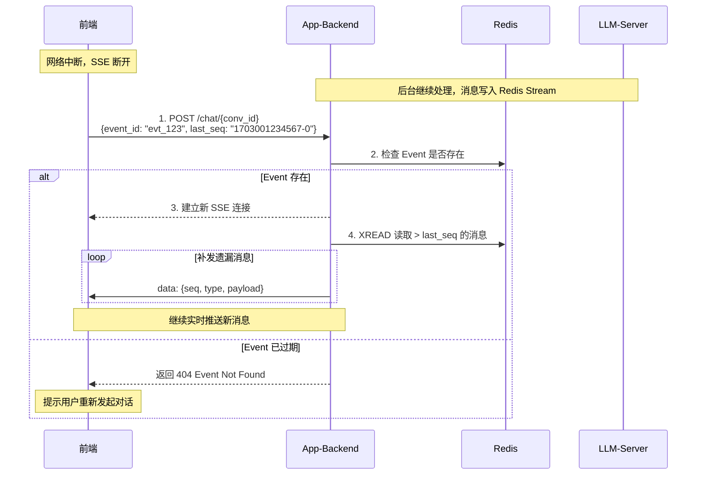

```mermaid
sequenceDiagram
    participant F as 前端
    participant B as App-Backend
    participant R as Redis
    participant L as LLM-Server

    Note over F: 网络中断，SSE 断开
    
    Note over B,L: 后台继续处理，消息写入 Redis Stream
    
    F->>B: 1. POST /chat/{conv_id}<br/>{event_id: "evt_123", last_seq: "1703001234567-0"}
    
    B->>R: 2. 检查 Event 是否存在
    
    alt Event 存在
        B-->>F: 3. 建立新 SSE 连接
        
        B->>R: 4. XREAD 读取 > last_seq 的消息
        
        loop 补发遗漏消息
            B->>F: data: {seq, type, payload}
        end
        
        Note over F,B: 继续实时推送新消息
        
    else Event 已过期
        B-->>F: 返回 404 Event Not Found
        Note over F: 提示用户重新发起对话
    end
```