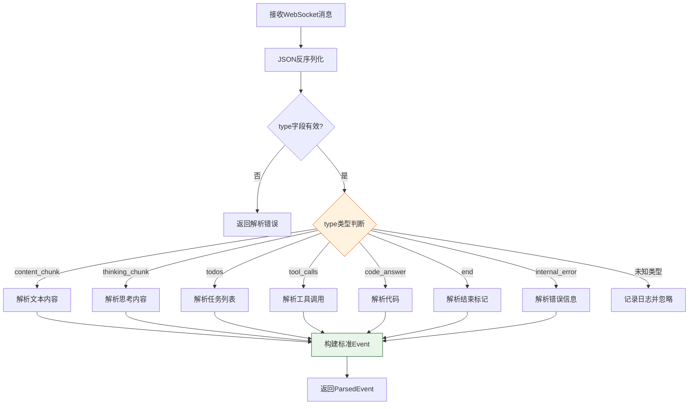

```mermaid
graph TD
    A[接收WebSocket消息] --> B[JSON反序列化]
    B --> C{type字段有效?}
    C -->|否| D[返回解析错误]
    C -->|是| E{type类型判断}
    
    E -->|content_chunk| F[解析文本内容]
    E -->|thinking_chunk| G[解析思考内容]
    E -->|todos| H[解析任务列表]
    E -->|tool_calls| I[解析工具调用]
    E -->|code_answer| J[解析代码]
    E -->|end| K[解析结束标记]
    E -->|internal_error| L[解析错误信息]
    E -->|未知类型| M[记录日志并忽略]
    
    F --> N[构建标准Event]
    G --> N
    H --> N
    I --> N
    J --> N
    K --> N
    L --> N
    
    N --> O[返回ParsedEvent]
    
    style E fill:#fff3e0,stroke:#e65100
    style N fill:#e8f5e9,stroke:#1b5e20
```