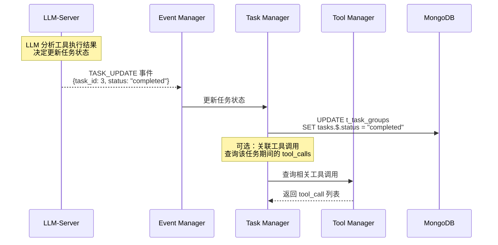

```mermaid
sequenceDiagram
    participant LLM as LLM-Server
    participant EM as Event Manager
    participant TaskMgr as Task Manager
    participant ToolMgr as Tool Manager
    participant DB as MongoDB

    Note over LLM: LLM 分析工具执行结果<br/>决定更新任务状态
    
    LLM-->>EM: TASK_UPDATE 事件<br/>{task_id: 3, status: "completed"}
    
    EM->>TaskMgr: 更新任务状态
    
    TaskMgr->>DB: UPDATE t_task_groups<br/>SET tasks.$.status = "completed"
    
    Note over TaskMgr: 可选：关联工具调用<br/>查询该任务期间的 tool_calls
    
    TaskMgr->>ToolMgr: 查询相关工具调用
    ToolMgr-->>TaskMgr: 返回 tool_call 列表
```