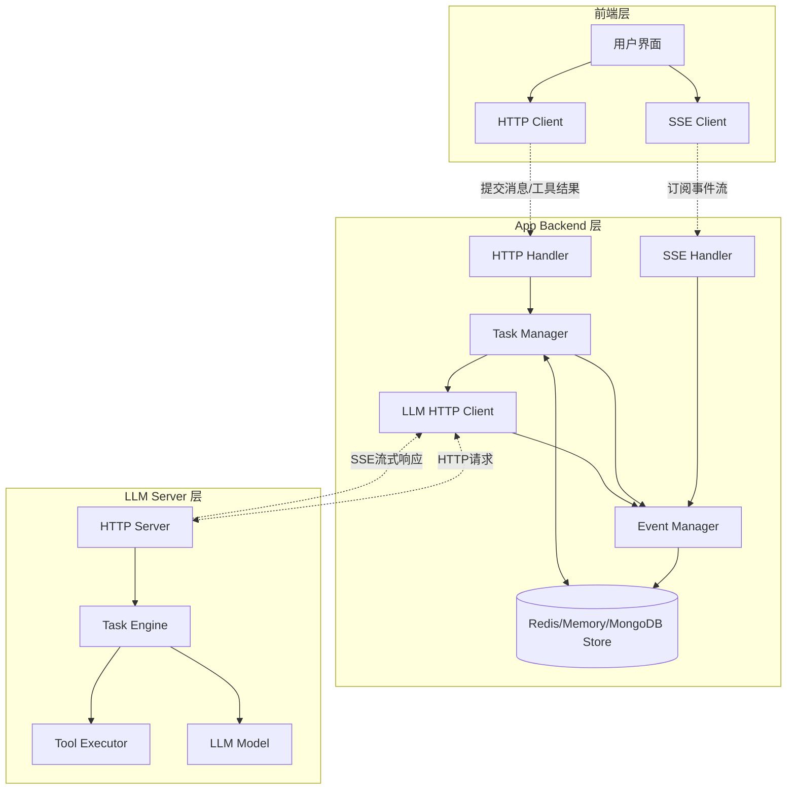

### 架构说明

1. **前端层**：通过 SSE 订阅事件流，通过 HTTP 提交用户消息和工具执行结果
2. **App Backend 层**：
   - Event Manager：管理所有事件的缓存、持久化和分发
   - Task Manager：管理任务生命周期
   - LLM Client：通过 HTTP 与 LLM Server 通信，接收 SSE 流式响应
3. **LLM Server 层**：接收 HTTP 请求，通过 SSE 流式返回响应

### 核心流程

**用户消息流程**：
```
前端 HTTP POST → App Backend → LLM Server (HTTP) → SSE 流式响应 → Event Manager → 前端 SSE
```

**工具调用流程**：
```
LLM Server 返回 tool_call → Event Manager 缓存 → 前端执行工具 → 前端 HTTP POST 工具结果 → LLM Server
```

---

# 二、数据表设计

## 2.1 t_tasks

| 字段名                | 类型         | 描述                           |
| ------------------ | ---------- | ---------------------------- |
| user_id            | int64      | 用户 id                        |
| task_id            | string     | 任务唯一标识符                      |
| conversation_id    | string     | 所属会话 ID，用于关联对话上下文            |
| message_id         | string     | 关联的消息 ID                     |
| status             | TaskStatus | 任务当前状态（规划中/执行中/已完成/失败等）      |
| description        | string     | 任务详细描述                       |
| todos              | []Todo     | 子任务列表，任务的具体执行步骤              |
| current_todo_index | int        | 当前正在执行的子任务索引位置               |
| enabled_providers  | []Provider | 本次会话使用的 provider 列表         |
| create_time        | int64      | 创建时间戳（秒）                     |
| update_time        | int64      | 更新时间戳（秒）                     |

### TaskStatus 枚举
```
PLANNING     // 规划中：LLM 正在生成执行计划
EXECUTING    // 执行中：正在执行 Todo 列表
COMPLETED    // 已完成：所有 Todo 成功完成
FAILED       // 失败：执行过程中出现错误
CANCELLED    // 已取消：用户主动取消
```

## 2.2 t_task_todos

| 字段名         | 类型            | 描述           |
| ----------- | ------------- | ------------ |
| user_id     | int64         | 用户 id        |
| todo_id     | string        | 子任务唯一标识符     |
| task_id     | string        | 所属的父任务 ID    |
| order       | int           | 子任务执行顺序编号    |
| status      | TodoStatus    | 子任务当前状态      |
| description | string        | 子任务详细描述      |
| providers   | []string      | 执行该子任务所使用的工具名称 |
| create_time | int64         | 创建时间戳（秒）     |
| update_time | int64         | 更新时间戳（秒）     |

### TodoStatus 枚举
```
PENDING      // 待执行：等待轮到自己执行
EXECUTING    // 执行中：正在执行
WAITING      // 等待中：等待用户完成工具调用
COMPLETED    // 已完成：执行成功
FAILED       // 失败：执行失败
```

## 2.3 t_events (新增)

| 字段名             | 类型        | 描述                      |
| --------------- | --------- | ----------------------- |
| event_id        | string    | 事件唯一标识符                 |
| user_id         | int64     | 用户 id                   |
| conversation_id | string    | 所属会话 ID                 |
| task_id         | string    | 关联的任务 ID（可为空）           |
| todo_id         | string    | 关联的子任务 ID（可为空）          |
| event_type      | EventType | 事件类型                    |
| event_data      | JSON      | 事件数据（具体内容根据 event_type） |
| status          | string    | 事件状态（pending/sent/failed） |
| retry_count     | int       | 重试次数                    |
| create_time     | int64     | 创建时间戳（秒）                |
| sent_time       | int64     | 发送时间戳（秒）                |

### EventType 枚举
```
TASK_CREATED           // 任务创建
TASK_UPDATED           // 任务更新
TODO_CREATED           // Todo 创建
TODO_UPDATED           // Todo 更新
LLM_RESPONSE_CHUNK     // LLM 流式响应片段
TOOL_CALL_REQUEST      // 工具调用请求
TOOL_CALL_RESULT       // 工具调用结果
ERROR                  // 错误信息
SYSTEM_MESSAGE         // 系统消息
```

## 2.4 t_tool_calls (新增)

| 字段名             | 类型     | 描述                         |
| --------------- | ------ | -------------------------- |
| call_id         | string | 工具调用唯一标识符                  |
| user_id         | int64  | 用户 id                      |
| conversation_id | string | 所属会话 ID                    |
| task_id         | string | 关联的任务 ID                   |
| todo_id         | string | 关联的子任务 ID                  |
| tool_name       | string | 工具名称                       |
| tool_params     | JSON   | 工具参数                       |
| result          | string | 工具执行结果                     |
| status          | string | 状态（pending/executing/completed/failed） |
| create_time     | int64  | 创建时间戳（秒）                   |
| complete_time   | int64  | 完成时间戳（秒）                   |

---

# 三、核心模块设计

## 3.1 Event Manager (事件管理器)

### 职责

1. 接收 LLM Server 的 SSE 流式响应
2. 将事件持久化到数据库
3. 管理事件队列，支持断线重连后的事件续传
4. 将事件推送给前端 SSE 连接

### 核心功能

#### 3.1.1 事件接收与持久化
```
接收 LLM Server SSE 事件 → 解析事件类型 → 持久化到 t_events → 推送到事件队列
```

#### 3.1.2 事件分发
```
事件队列 → 根据 conversation_id 查找活跃 SSE 连接 → 推送事件 → 标记已发送
```

#### 3.1.3 断线重连与续传
```
前端 SSE 重连 → 携带 last_event_id → 查询该 conversation 未发送的事件 → 按顺序推送
```

**续传机制**：
- 前端 SSE 连接时携带 `last_event_id` 参数
- Event Manager 查询 `t_events` 表中该 conversation 所有 `event_id > last_event_id` 且 `status != sent` 的事件
- 按 `create_time` 顺序重新推送

#### 3.1.4 事件过期清理
```
定时任务 → 删除 N 天前的已发送事件 → 释放存储空间
```

### API 设计

#### SSE 连接端点
```
GET /api/v1/events/stream?conversation_id={id}&last_event_id={optional}

Response (SSE):
event: task_created
id: evt_123456
data: {"task_id": "...", "description": "..."}

event: llm_response_chunk
id: evt_123457
data: {"content": "...", "is_final": false}

event: tool_call_request
id: evt_123458
data: {"call_id": "call_xxx", "tool_name": "...", "params": {...}}
```

---

## 3.2 Task Manager (任务管理器)

### 职责

1. 管理 Task 和 Todo 的生命周期
2. 协调前端、LLM Server 之间的消息流转
3. 处理工具调用的请求和结果

### 核心功能

#### 3.2.1 用户消息处理
```
前端 POST 用户消息 → 创建 Task (PLANNING) → 调用 LLM Server → 接收 SSE 响应 → 更新 Task 状态
```

#### 3.2.2 工具调用协调
```
LLM Server 返回 tool_call → Event Manager 推送给前端 → 前端执行工具 → POST 工具结果 → 转发给 LLM Server
```

#### 3.2.3 任务状态同步
```
监听 LLM Server 的事件 → 解析任务/Todo 状态变更 → 更新数据库 → 通过 Event Manager 通知前端
```

### API 设计

#### 提交用户消息
```
POST /api/v1/chat/message

Request:
{
    "conversation_id": "conv_123",
    "enabled_providers": [
        {"provider_id": "eth_mainnet", "updated_at": 1703001234}
    ],
    "role": "user",
    "content": "帮我查询 ETH 余额"
}

Response:
{
    "task_id": "task_456",
    "status": "planning"
}
```

#### 提交工具执行结果
```
POST /api/v1/chat/tool-result

Request:
{
    "conversation_id": "conv_123",
    "task_id": "task_456",
    "enabled_providers": [
        {"provider_id": "eth_mainnet", "updated_at": 1703001234}
    ],
    "role": "tool",
    "tool_results": [
        {
            "call_id": "call_xxx",
            "content": "{\"balance\": \"1.5 ETH\"}"
        }
    ]
}

Response:
{
    "success": true
}
```

---

## 3.3 LLM Client (LLM 客户端)

### 职责

1. 封装与 LLM Server 的 HTTP 通信
2. 处理 SSE 流式响应
3. 将响应事件转发给 Event Manager

### 核心功能

#### 3.3.1 发送消息
```
构造 HTTP 请求 → POST 到 LLM Server → 建立 SSE 连接 → 接收流式响应
```

#### 3.3.2 SSE 响应处理
```
接收 SSE 事件 → 解析事件类型 → 转发给 Event Manager → 更新本地状态
```

#### 3.3.3 错误处理与重试
```
检测连接断开 → 记录最后接收的 event_id → 重建连接 → 续传未接收的事件
```