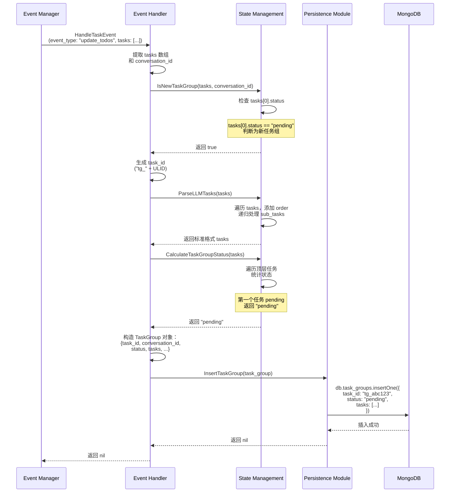

```mermaid
sequenceDiagram
    participant EM as Event Manager
    participant EH as Event Handler
    participant SM as State Management
    participant Persist as Persistence Module
    participant DB as MongoDB

    EM->>EH: HandleTaskEvent<br/>(event_type: "update_todos", tasks: [...])
    
    EH->>EH: 提取 tasks 数组<br/>和 conversation_id
    
    EH->>SM: IsNewTaskGroup(tasks, conversation_id)
    
    SM->>SM: 检查 tasks[0].status
    Note over SM: tasks[0].status == "pending"<br/>判断为新任务组
    SM-->>EH: 返回 true
    
    EH->>EH: 生成 task_id<br/>("tg_" + ULID)
    
    EH->>SM: ParseLLMTasks(tasks)
    SM->>SM: 遍历 tasks，添加 order<br/>递归处理 sub_tasks
    SM-->>EH: 返回标准格式 tasks
    
    EH->>SM: CalculateTaskGroupStatus(tasks)
    SM->>SM: 遍历顶层任务<br/>统计状态
    Note over SM: 第一个任务 pending<br/>返回 "pending"
    SM-->>EH: 返回 "pending"
    
    EH->>EH: 构造 TaskGroup 对象：<br/>{task_id, conversation_id,<br/>status, tasks, ...}
    
    EH->>Persist: InsertTaskGroup(task_group)
    Persist->>DB: db.task_groups.insertOne({<br/>  task_id: "tg_abc123",<br/>  status: "pending",<br/>  tasks: [...]<br/>})
    DB-->>Persist: 插入成功
    
    Persist-->>EH: 返回 nil
    EH-->>EM: 返回 nil
```