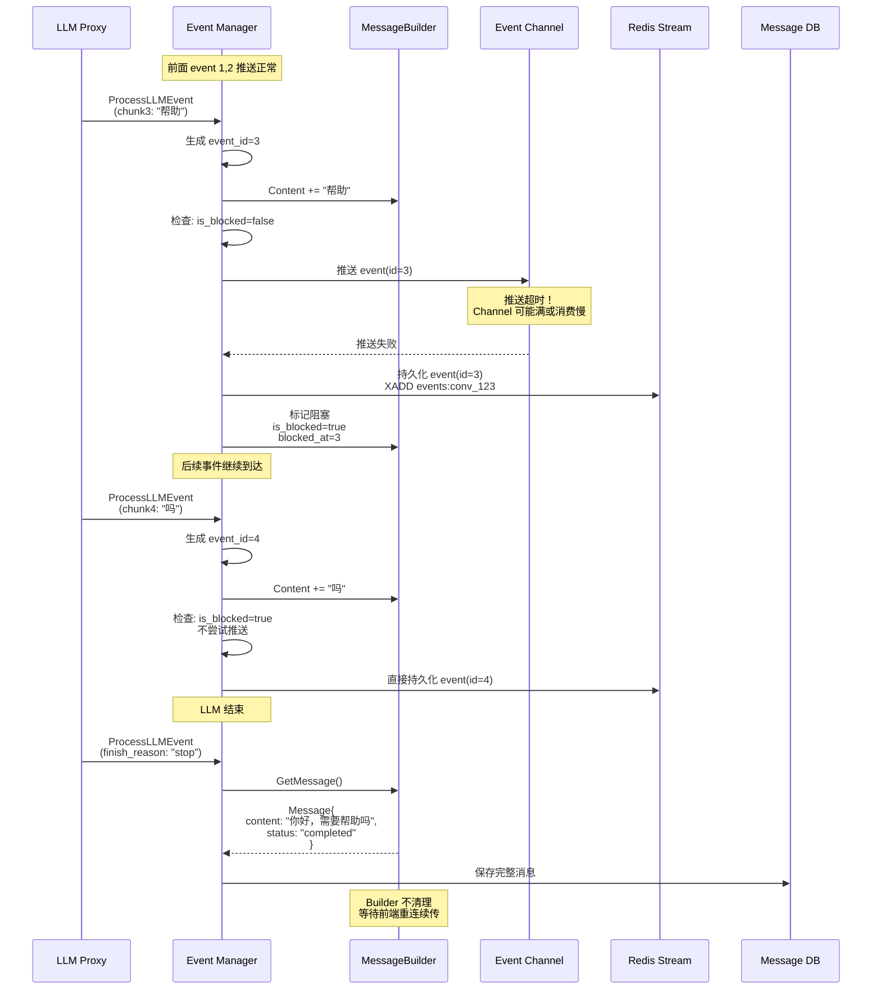

```mermaid
sequenceDiagram
    participant LLMProxy as LLM Proxy
    participant EventMgr as Event Manager
    participant Builder as MessageBuilder
    participant CH as Event Channel
    participant Redis as Redis Stream
    participant MsgDB as Message DB

    Note over EventMgr: 前面 event 1,2 推送正常

    LLMProxy->>EventMgr: ProcessLLMEvent<br/>(chunk3: "帮助")
    EventMgr->>EventMgr: 生成 event_id=3
    EventMgr->>Builder: Content += "帮助"
    
    EventMgr->>EventMgr: 检查: is_blocked=false
    EventMgr->>CH: 推送 event(id=3)
    
    Note over CH: 推送超时！<br/>Channel 可能满或消费慢
    
    CH-->>EventMgr: 推送失败
    
    EventMgr->>Redis: 持久化 event(id=3)<br/>XADD events:conv_123
    EventMgr->>Builder: 标记阻塞<br/>is_blocked=true<br/>blocked_at=3
    
    Note over EventMgr: 后续事件继续到达
    
    LLMProxy->>EventMgr: ProcessLLMEvent<br/>(chunk4: "吗")
    EventMgr->>EventMgr: 生成 event_id=4
    EventMgr->>Builder: Content += "吗"
    
    EventMgr->>EventMgr: 检查: is_blocked=true<br/>不尝试推送
    EventMgr->>Redis: 直接持久化 event(id=4)
    
    Note over EventMgr: LLM 结束
    
    LLMProxy->>EventMgr: ProcessLLMEvent<br/>(finish_reason: "stop")
    
    EventMgr->>Builder: GetMessage()
    Builder-->>EventMgr: Message{<br/>  content: "你好，需要帮助吗",<br/>  status: "completed"<br/>}
    
    EventMgr->>MsgDB: 保存完整消息
    
    Note over Builder: Builder 不清理<br/>等待前端重连续传
```