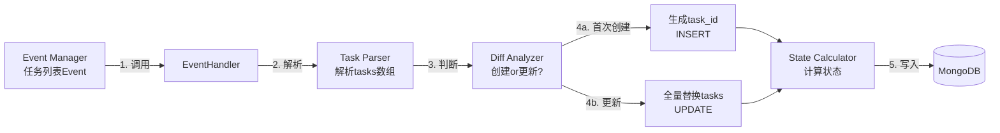

```mermaid
graph LR
    Event["Event Manager<br/>任务列表Event"] -->|"1. 调用"| EventHandler
    EventHandler -->|"2. 解析"| TaskParser["Task Parser<br/>解析tasks数组"]
    TaskParser -->|"3. 判断"| DiffAnalyzer["Diff Analyzer<br/>创建or更新?"]
    
    DiffAnalyzer -->|"4a. 首次创建"| Create["生成task_id<br/>INSERT"]
    DiffAnalyzer -->|"4b. 更新"| Update["全量替换tasks<br/>UPDATE"]
    
    Create --> StateCalc["State Calculator<br/>计算状态"]
    Update --> StateCalc
    
    StateCalc -->|"5. 写入"| MongoDB[("MongoDB")]
```