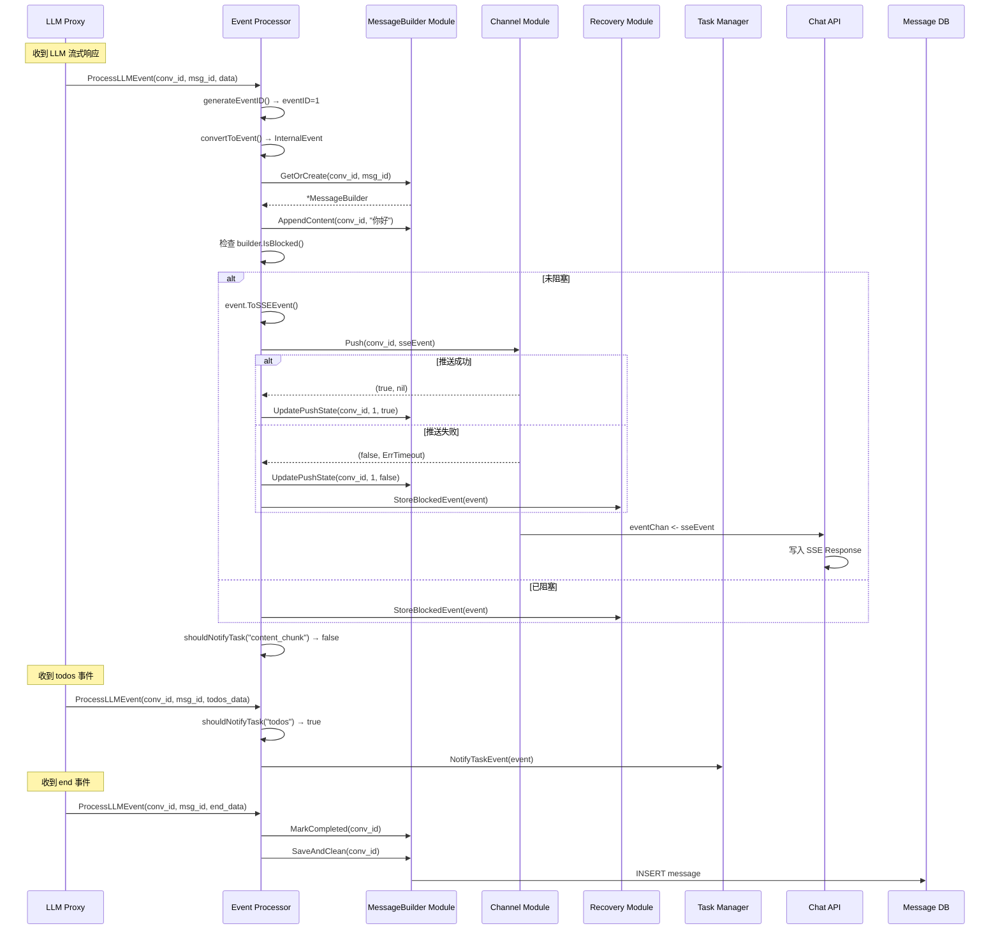

```mermaid
sequenceDiagram
    participant LLMProxy as LLM Proxy
    participant Processor as Event Processor
    participant Builder as MessageBuilder Module
    participant Channel as Channel Module
    participant Recovery as Recovery Module
    participant TaskMgr as Task Manager
    participant ChatAPI as Chat API
    participant DB as Message DB

    Note over LLMProxy: 收到 LLM 流式响应

    LLMProxy->>Processor: ProcessLLMEvent(conv_id, msg_id, data)
    
    Processor->>Processor: generateEventID() → eventID=1
    Processor->>Processor: convertToEvent() → InternalEvent
    
    Processor->>Builder: GetOrCreate(conv_id, msg_id)
    Builder-->>Processor: *MessageBuilder
    
    Processor->>Builder: AppendContent(conv_id, "你好")
    
    Processor->>Processor: 检查 builder.IsBlocked()
    
    alt 未阻塞
        Processor->>Processor: event.ToSSEEvent()
        Processor->>Channel: Push(conv_id, sseEvent)
        
        alt 推送成功
            Channel-->>Processor: (true, nil)
            Processor->>Builder: UpdatePushState(conv_id, 1, true)
        else 推送失败
            Channel-->>Processor: (false, ErrTimeout)
            Processor->>Builder: UpdatePushState(conv_id, 1, false)
            Processor->>Recovery: StoreBlockedEvent(event)
        end
        
        Channel->>ChatAPI: eventChan <- sseEvent
        ChatAPI->>ChatAPI: 写入 SSE Response
    else 已阻塞
        Processor->>Recovery: StoreBlockedEvent(event)
    end
    
    Processor->>Processor: shouldNotifyTask("content_chunk") → false
    
    Note over LLMProxy: 收到 todos 事件
    
    LLMProxy->>Processor: ProcessLLMEvent(conv_id, msg_id, todos_data)
    Processor->>Processor: shouldNotifyTask("todos") → true
    Processor->>TaskMgr: NotifyTaskEvent(event)
    
    Note over LLMProxy: 收到 end 事件
    
    LLMProxy->>Processor: ProcessLLMEvent(conv_id, msg_id, end_data)
    Processor->>Builder: MarkCompleted(conv_id)
    Processor->>Builder: SaveAndClean(conv_id)
    Builder->>DB: INSERT message
```