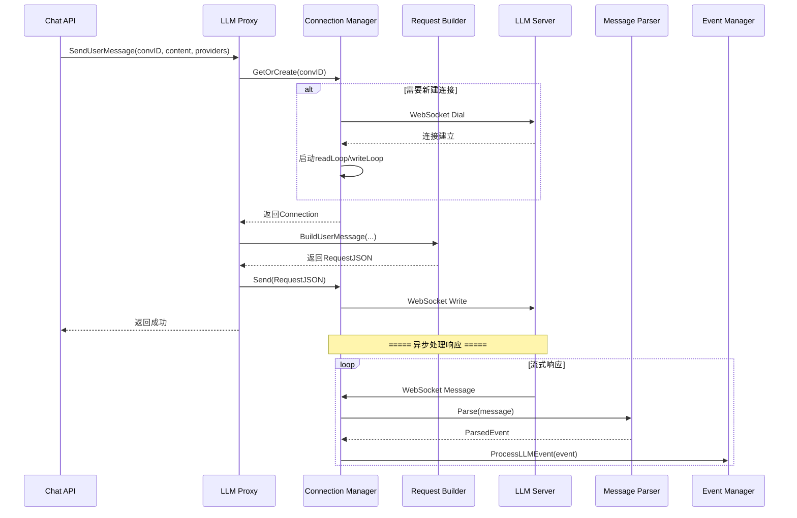

```mermaid
sequenceDiagram
    participant API as Chat API
    participant Proxy as LLM Proxy
    participant ConnMgr as Connection Manager
    participant Builder as Request Builder
    participant LLM as LLM Server
    participant Parser as Message Parser
    participant EM as Event Manager
    
    API->>Proxy: SendUserMessage(convID, content, providers)
    
    Proxy->>ConnMgr: GetOrCreate(convID)
    alt 需要新建连接
        ConnMgr->>LLM: WebSocket Dial
        LLM-->>ConnMgr: 连接建立
        ConnMgr->>ConnMgr: 启动readLoop/writeLoop
    end
    ConnMgr-->>Proxy: 返回Connection
    
    Proxy->>Builder: BuildUserMessage(...)
    Builder-->>Proxy: 返回RequestJSON
    
    Proxy->>ConnMgr: Send(RequestJSON)
    ConnMgr->>LLM: WebSocket Write
    
    Proxy-->>API: 返回成功
    
    Note over ConnMgr,LLM: ===== 异步处理响应 =====
    
    loop 流式响应
        LLM->>ConnMgr: WebSocket Message
        ConnMgr->>Parser: Parse(message)
        Parser-->>ConnMgr: ParsedEvent
        ConnMgr->>EM: ProcessLLMEvent(event)
    end
```