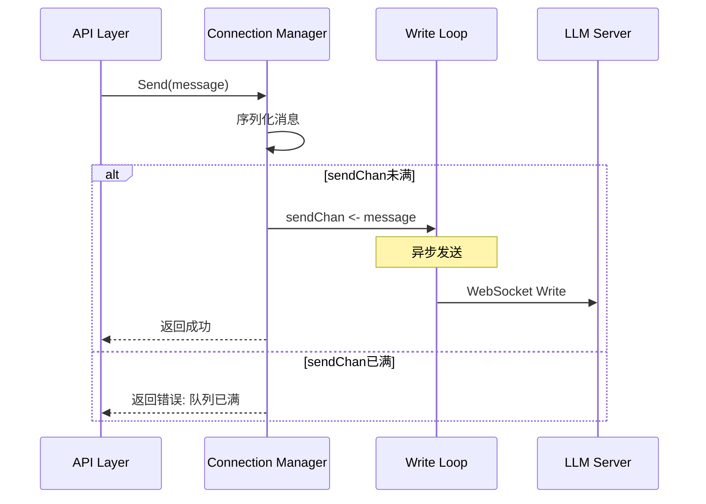

#### 资源清理策略

**空闲连接回收**:
- 后台定时任务（每5分钟执行）
- 检查 lastActiveAt 时间
- 超过30分钟未活跃则关闭连接
- 从连接池移除

**主动关闭流程**:
1. 发送WebSocket Close帧
2. 关闭 closeChan 触发协程退出
3. 等待协程结束（最多5秒）
4. 关闭底层TCP连接
5. 从连接池移除

### 3.1.4 RequestBuilder (请求构建器)

#### 职责范围

将业务层的请求参数转换为 LLM Server 期望的协议格式，屏蔽协议细节。

#### 请求类型

**用户消息请求**:
```
{
  "conversation_id": "会话ID",
  "message_id": "消息ID (ULID)",
  "role": "user",
  "content": "用户输入的文本",
  "enabled_providers": [
    {
      "provider_id": "provider_123",
      "updated_at": 1234567890
    }
  ]
}
```

**工具结果请求**:
```
{
  "conversation_id": "会话ID",
  "message_id": "消息ID",
  "role": "tool",
  "tool_results": [
    {
      "call_id": "工具调用ID",
      "content": "执行结果JSON字符串"
    }
  ],
  "enabled_providers": [...]
}
```

#### 构建逻辑

**用户消息构建**:
1. 生成消息ID（ULID格式）
2. 查询用户订阅的Provider列表
3. 过滤已启用的Provider
4. 获取Provider最后更新时间
5. 组装请求JSON

**工具结果构建**:
1. 复用原消息ID
2. 从请求中提取 call_id 和 result
3. 保持Provider列表不变
4. 组装请求JSON

#### 扩展点设计

- **Provider过滤策略**: 支持自定义Provider选择逻辑
- **请求预处理钩子**: 允许在发送前修改请求
- **请求日志记录**: 可插拔的日志组件

### 3.1.5 MessageParser (消息解析器)

#### 职责范围

解析 LLM Server 返回的流式消息，转换为标准化的事件对象。

#### LLM Server响应格式

**基础消息结构**:
```
{
  "type": "事件类型",
  "message_id": "消息ID",
  "data": {事件具体数据},
  "finish_reason": "结束原因 (可选)"
}
```