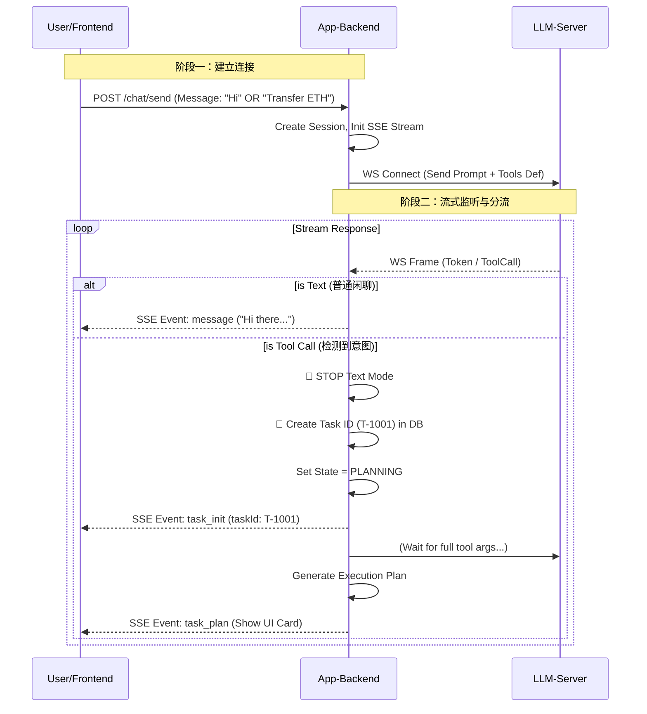

```mermaid
sequenceDiagram
    participant U as User/Frontend
    participant B as App-Backend
    participant L as LLM-Server

    Note over U, B: 阶段一：建立连接
    U->>B: POST /chat/send (Message: "Hi" OR "Transfer ETH")
    B->>B: Create Session, Init SSE Stream
    B->>L: WS Connect (Send Prompt + Tools Def)

    Note over B, L: 阶段二：流式监听与分流
    loop Stream Response
        L-->>B: WS Frame (Token / ToolCall)
        
        alt is Text (普通闲聊)
            B-->>U: SSE Event: message ("Hi there...")
        else is Tool Call (检测到意图)
            B->>B: 🛑 STOP Text Mode
            B->>B: 🚀 Create Task ID (T-1001) in DB
            B->>B: Set State = PLANNING
            B-->>U: SSE Event: task_init (taskId: T-1001)
            B->>L: (Wait for full tool args...)
            B->>B: Generate Execution Plan
            B-->>U: SSE Event: task_plan (Show UI Card)
        end
    end
```