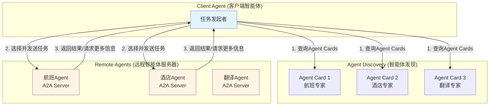

```mermaid
graph TB
    subgraph "Client Agent (客户端智能体)"
        CA[任务发起者]
    end
    
    subgraph "Agent Discovery (智能体发现)"
        AC1[Agent Card 1<br/>航班专家]
        AC2[Agent Card 2<br/>酒店专家]
        AC3[Agent Card 3<br/>翻译专家]
    end
    
    subgraph "Remote Agents (远程智能体服务器)"
        RA1[航班Agent<br/>A2A Server]
        RA2[酒店Agent<br/>A2A Server]
        RA3[翻译Agent<br/>A2A Server]
    end
    
    CA -->|1. 查询Agent Cards| AC1
    CA -->|1. 查询Agent Cards| AC2
    CA -->|1. 查询Agent Cards| AC3
    
    CA -->|2. 选择并发送任务| RA1
    CA -->|2. 选择并发送任务| RA2
    
    RA1 -->|3. 返回结果/请求更多信息| CA
    RA2 -->|3. 返回结果/请求更多信息| CA
    
    style CA fill:#e1f5ff
    style RA1 fill:#fff4e1
    style RA2 fill:#fff4e1
    style RA3 fill:#fff4e1
```