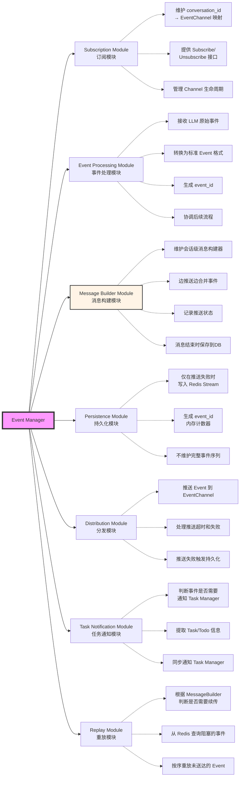

```mermaid
graph LR
    EM[Event Manager]
    
    EM --> SM[Subscription Module<br/>订阅模块]
    EM --> EPM[Event Processing Module<br/>事件处理模块]
    EM --> MBM[Message Builder Module<br/>消息构建模块]
    EM --> PM[Persistence Module<br/>持久化模块]
    EM --> DM[Distribution Module<br/>分发模块]
    EM --> TNM[Task Notification Module<br/>任务通知模块]
    EM --> RM[Replay Module<br/>重放模块]
    
    SM -.-> SM1[维护 conversation_id<br/>→ EventChannel 映射]
    SM -.-> SM2[提供 Subscribe/<br/>Unsubscribe 接口]
    SM -.-> SM3[管理 Channel 生命周期]
    
    EPM -.-> EPM1[接收 LLM 原始事件]
    EPM -.-> EPM2[转换为标准 Event 格式]
    EPM -.-> EPM3[生成 event_id]
    EPM -.-> EPM4[协调后续流程]
    
    MBM -.-> MBM1[维护会话级消息构建器]
    MBM -.-> MBM2[边推送边合并事件]
    MBM -.-> MBM3[记录推送状态]
    MBM -.-> MBM4[消息结束时保存到DB]
    
    PM -.-> PM1[仅在推送失败时<br/>写入 Redis Stream]
    PM -.-> PM2[生成 event_id<br/>内存计数器]
    PM -.-> PM3[不维护完整事件序列]
    
    DM -.-> DM1[推送 Event 到 EventChannel]
    DM -.-> DM2[处理推送超时和失败]
    DM -.-> DM3[推送失败触发持久化]
    
    TNM -.-> TNM1[判断事件是否需要<br/>通知 Task Manager]
    TNM -.-> TNM2[提取 Task/Todo 信息]
    TNM -.-> TNM3[同步通知 Task Manager]
    
    RM -.-> RM1[根据 MessageBuilder<br/>判断是否需要续传]
    RM -.-> RM2[从 Redis 查询阻塞的事件]
    RM -.-> RM3[按序重放未送达的 Event]
    
    style EM fill:#f9f,stroke:#333,stroke-width:4px
    style MBM fill:#fff4e6,stroke:#333,stroke-width:2px

```