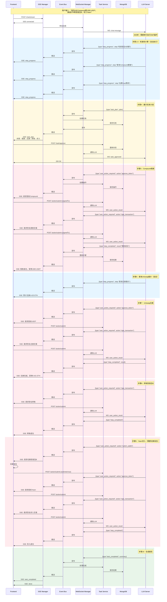

```mermaid
sequenceDiagram
    participant F as Frontend
    participant SSE as SSE Manager
    participant EB as Event Bus
    participant WS as WebSocket Manager
    participant TS as Task Service
    participant DB as MongoDB
    participant L as LLM Server

    Note over F,L: 用户输入："钱包A从Compound借1000 USDT，<br/>换成ETH转到钱包B，存入Yearn"
    
    F->>SSE: POST /chat/stream
    SSE->>F: SSE connected
    SSE->>WS: 转发消息
    WS->>L: WS: chat message
    
    Note over L: AI分析：需要串行执行DeFi操作
    
    rect rgb(230, 245, 255)
        Note over L: 步骤1-3：检查和计算（自动执行）
        L->>WS: {type:"step_progress", step:"检查钱包A余额"}
        WS->>EB: 发布
        EB->>SSE: 推送
        SSE->>F: SSE: step_progress
        
        L->>WS: {type:"step_progress", step:"查询Compound额度"}
        WS->>EB: 发布
        EB->>SSE: 推送
        SSE->>F: SSE: step_progress
        
        L->>WS: {type:"step_progress", step:"估算Gas费用"}
        WS->>EB: 发布
        EB->>SSE: 推送
        SSE->>F: SSE: step_progress
    end
    
    rect rgb(255, 249, 225)
        Note over L: 步骤4：展示任务计划
        L->>WS: {type:"task_plan", plan}
        WS->>EB: 发布
        EB->>TS: 创建任务
        TS->>DB: 保存任务
        TS->>EB: 发布
        EB->>SSE: 推送
        SSE->>F: SSE: task_plan<br/>步骤：借款→兑换→转账→存入
        
        F->>TS: POST /task/approve
        TS->>DB: 更新状态
        TS->>WS: 通知LLM
        WS->>L: WS: task_approved
        TS->>F: 200 OK
    end
    
    rect rgb(255, 235, 238)
        Note over L: 步骤5：Compound借款
        L->>WS: {type:"user_action_required", action:"approve_token"}
        WS->>EB: 发布
        EB->>TS: 创建操作
        TS->>DB: 保存操作
        EB->>SSE: 推送
        SSE->>F: SSE: 请求授权Compound
        
        F->>TS: POST /action/submit {signedTx}
        TS->>WS: 通知LLM
        WS->>L: WS: user_action_result
        
        L->>WS: {type:"user_action_required", action:"sign_transaction"}
        WS->>EB: 发布
        EB->>SSE: 推送
        SSE->>F: SSE: 请求签名借款交易
        
        F->>TS: POST /action/submit {signedTx}
        TS->>WS: 通知LLM
        WS->>L: WS: user_action_result
        
        L->>WS: {type:"step_completed", result:"借款成功"}
        WS->>EB: 发布
        EB->>TS: 更新步骤
        TS->>DB: 保存结果
        EB->>SSE: 推送
        SSE->>F: SSE: 借款成功，获得1000 USDT
    end
    
    rect rgb(230, 245, 255)
        Note over L: 步骤6：查询Uniswap报价（自动）
        L->>WS: {type:"step_progress", step:"查询兑换报价"}
        WS->>EB: 发布
        EB->>SSE: 推送
        SSE->>F: SSE: 预计兑换0.423 ETH
    end
    
    rect rgb(255, 235, 238)
        Note over L: 步骤7：Uniswap兑换
        L->>WS: {type:"user_action_required", action:"approve_token"}
        WS->>EB: 发布
        EB->>SSE: 推送
        SSE->>F: SSE: 请求授权USDT
        F->>TS: POST /action/submit
        
        L->>WS: {type:"user_action_required", action:"sign_transaction"}
        WS->>EB: 发布
        EB->>SSE: 推送
        SSE->>F: SSE: 请求签名兑换交易
        F->>TS: POST /action/submit
        TS->>WS: 通知LLM
        WS->>L: WS: user_action_result
        
        L->>WS: {type:"step_completed", result}
        WS->>EB: 发布
        EB->>SSE: 推送
        SSE->>F: SSE: 兑换完成，获得0.421 ETH
    end
    
    rect rgb(255, 235, 238)
        Note over L: 步骤8：转账到钱包B
        L->>WS: {type:"user_action_required", action:"sign_transaction"}
        WS->>EB: 发布
        EB->>SSE: 推送
        SSE->>F: SSE: 请求签名转账
        
        F->>TS: POST /action/submit
        TS->>WS: 通知LLM
        WS->>L: WS: user_action_result
        
        L->>WS: {type:"step_completed"}
        WS->>EB: 发布
        EB->>SSE: 推送
        SSE->>F: SSE: 转账成功
    end
    
    rect rgb(255, 235, 238)
        Note over L: 步骤9：Yearn存入（需要切换钱包）
        L->>WS: {type:"user_action_required", action:"switch_wallet"}
        WS->>EB: 发布
        EB->>SSE: 推送
        SSE->>F: SSE: 请求切换到钱包B
        F->>F: 切换钱包
        F->>TS: POST /action/submit {switched:true}
        
        L->>WS: {type:"user_action_required", action:"approve_token"}
        WS->>EB: 发布
        EB->>SSE: 推送
        SSE->>F: SSE: 请求授权Yearn
        F->>TS: POST /action/submit
        
        L->>WS: {type:"user_action_required", action:"sign_transaction"}
        WS->>EB: 发布
        EB->>SSE: 推送
        SSE->>F: SSE: 请求签名存入交易
        F->>TS: POST /action/submit
        TS->>WS: 通知LLM
        WS->>L: WS: user_action_result
        
        L->>WS: {type:"step_completed"}
        WS->>EB: 发布
        EB->>SSE: 推送
        SSE->>F: SSE: 存入成功
    end
    
    rect rgb(232, 245, 233)
        Note over L: 步骤10：生成报告
        L->>WS: {type:"task_completed", summary}
        WS->>EB: 发布
        EB->>TS: 处理完成
        TS->>DB: 保存结果
        EB->>SSE: 推送
        SSE->>F: SSE: task_completed
        SSE->>F: SSE: done
    end
```