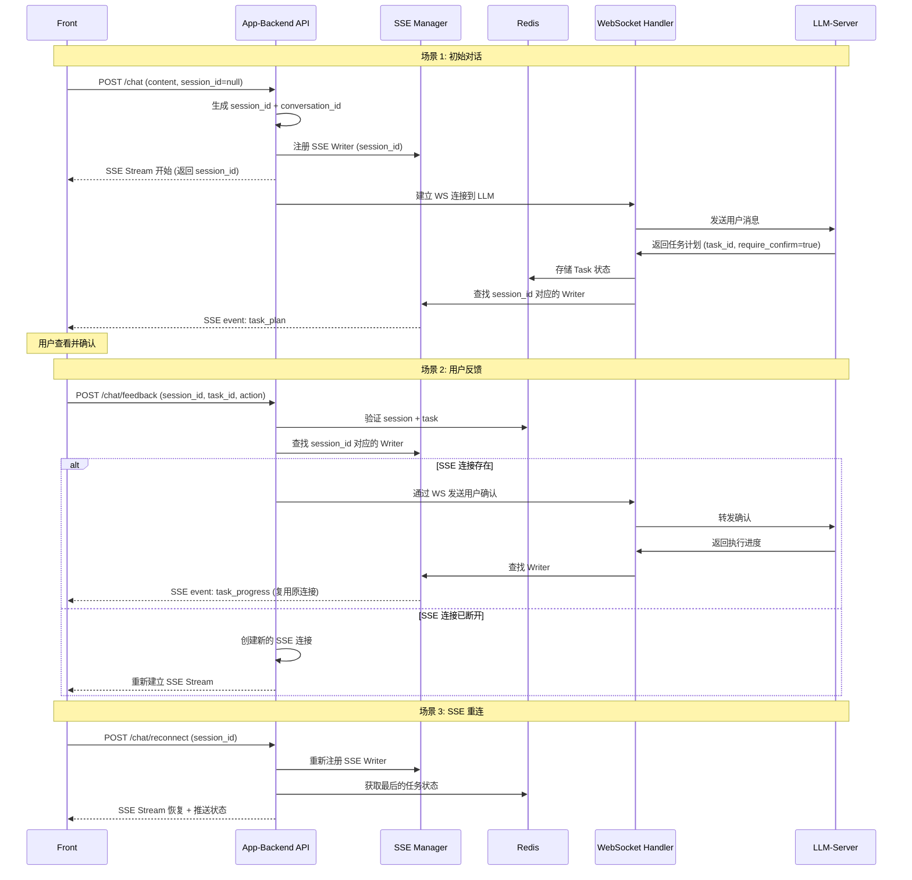

```mermaid
sequenceDiagram
    participant F as Front
    participant API as App-Backend API
    participant SSE_Mgr as SSE Manager
    participant Redis as Redis
    participant WS as WebSocket Handler
    participant LLM as LLM-Server
    
    Note over F,LLM: 场景 1: 初始对话
    F->>API: POST /chat (content, session_id=null)
    API->>API: 生成 session_id + conversation_id
    API->>SSE_Mgr: 注册 SSE Writer (session_id)
    API-->>F: SSE Stream 开始 (返回 session_id)
    
    API->>WS: 建立 WS 连接到 LLM
    WS->>LLM: 发送用户消息
    
    LLM->>WS: 返回任务计划 (task_id, require_confirm=true)
    WS->>Redis: 存储 Task 状态
    WS->>SSE_Mgr: 查找 session_id 对应的 Writer
    SSE_Mgr-->>F: SSE event: task_plan
    
    Note over F: 用户查看并确认
    
    Note over F,LLM: 场景 2: 用户反馈
    F->>API: POST /chat/feedback (session_id, task_id, action)
    API->>Redis: 验证 session + task
    API->>SSE_Mgr: 查找 session_id 对应的 Writer
    
    alt SSE 连接存在
        API->>WS: 通过 WS 发送用户确认
        WS->>LLM: 转发确认
        LLM->>WS: 返回执行进度
        WS->>SSE_Mgr: 查找 Writer
        SSE_Mgr-->>F: SSE event: task_progress (复用原连接)
    else SSE 连接已断开
        API->>API: 创建新的 SSE 连接
        API-->>F: 重新建立 SSE Stream
    end
    
    Note over F,LLM: 场景 3: SSE 重连
    F->>API: POST /chat/reconnect (session_id)
    API->>SSE_Mgr: 重新注册 SSE Writer
    API->>Redis: 获取最后的任务状态
    API-->>F: SSE Stream 恢复 + 推送状态
```