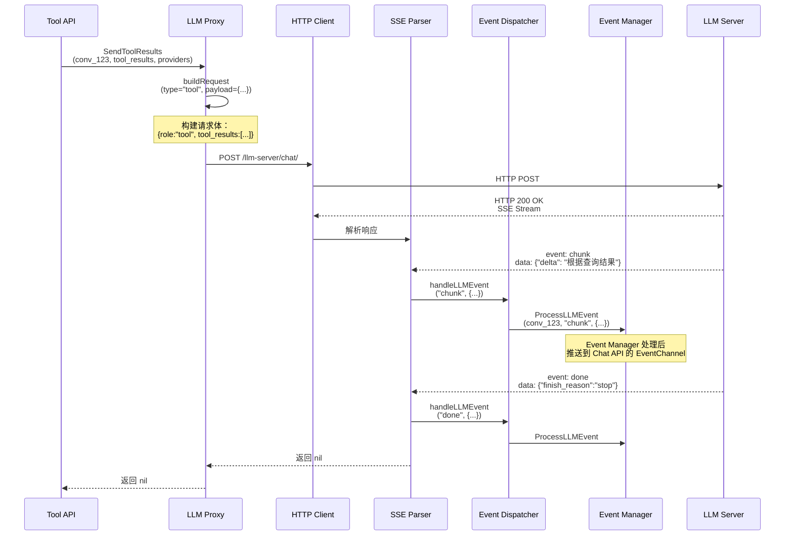

```mermaid
sequenceDiagram
    participant ToolAPI as Tool API
    participant LLMProxy as LLM Proxy
    participant HTTPClient as HTTP Client
    participant SSEParser as SSE Parser
    participant EventDisp as Event Dispatcher
    participant EventMgr as Event Manager
    participant LLM as LLM Server

    ToolAPI->>LLMProxy: SendToolResults<br/>(conv_123, tool_results, providers)
    
    LLMProxy->>LLMProxy: buildRequest<br/>(type="tool", payload={...})
    Note over LLMProxy: 构建请求体：<br/>{role:"tool", tool_results:[...]}
    
    LLMProxy->>HTTPClient: POST /llm-server/chat/
    HTTPClient->>LLM: HTTP POST
    
    LLM-->>HTTPClient: HTTP 200 OK<br/>SSE Stream
    
    HTTPClient->>SSEParser: 解析响应
    
    LLM-->>SSEParser: event: chunk<br/>data: {"delta": "根据查询结果"}
    SSEParser->>EventDisp: handleLLMEvent<br/>("chunk", {...})
    EventDisp->>EventMgr: ProcessLLMEvent<br/>(conv_123, "chunk", {...})
    
    Note over EventMgr: Event Manager 处理后<br/>推送到 Chat API 的 EventChannel
    
    LLM-->>SSEParser: event: done<br/>data: {"finish_reason":"stop"}
    SSEParser->>EventDisp: handleLLMEvent<br/>("done", {...})
    EventDisp->>EventMgr: ProcessLLMEvent
    
    SSEParser-->>LLMProxy: 返回 nil
    LLMProxy-->>ToolAPI: 返回 nil
```