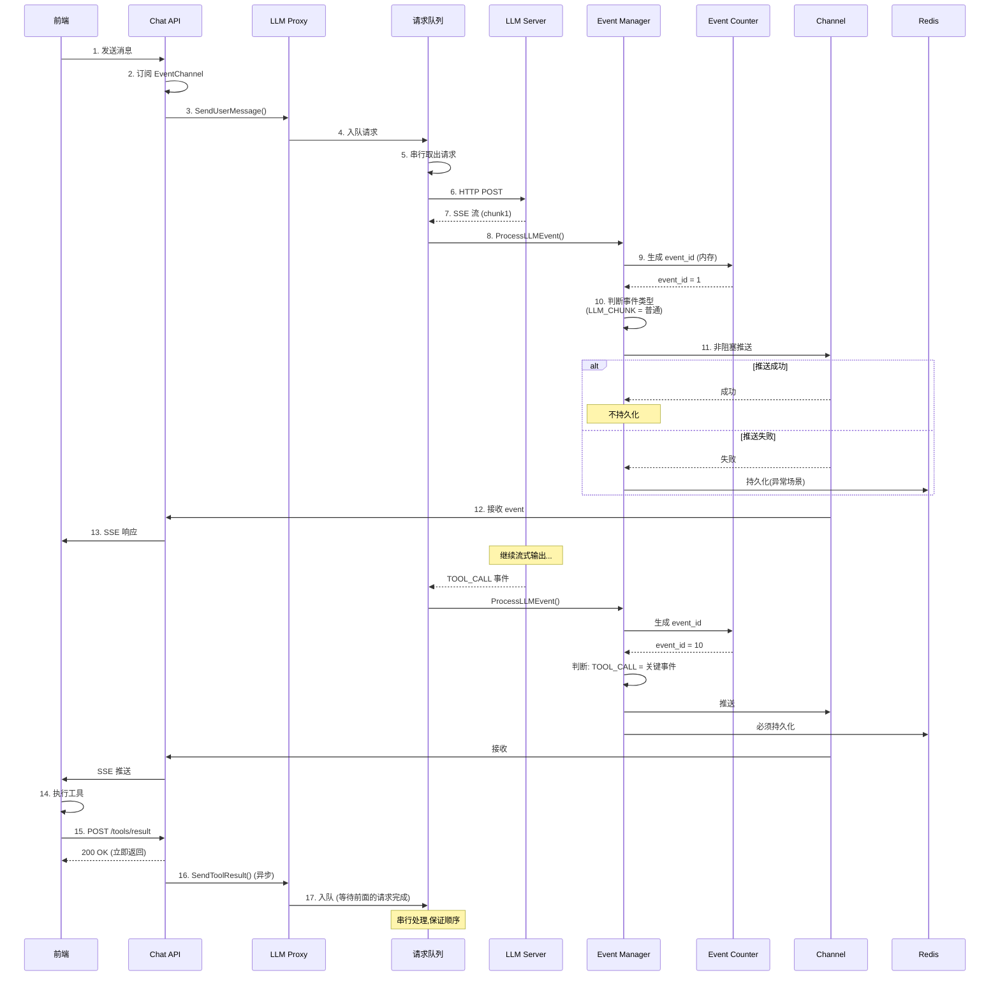

```mermaid
sequenceDiagram
    participant FE as 前端
    participant ChatAPI as Chat API
    participant LLMProxy as LLM Proxy
    participant Queue as 请求队列
    participant LLM as LLM Server
    participant EM as Event Manager
    participant Counter as Event Counter
    participant CH as Channel
    participant Redis as Redis

    FE->>ChatAPI: 1. 发送消息
    ChatAPI->>ChatAPI: 2. 订阅 EventChannel
    ChatAPI->>LLMProxy: 3. SendUserMessage()
    
    LLMProxy->>Queue: 4. 入队请求
    Queue->>Queue: 5. 串行取出请求
    Queue->>LLM: 6. HTTP POST
    
    LLM-->>Queue: 7. SSE 流 (chunk1)
    Queue->>EM: 8. ProcessLLMEvent()
    
    EM->>Counter: 9. 生成 event_id (内存)
    Counter-->>EM: event_id = 1
    
    EM->>EM: 10. 判断事件类型<br/>(LLM_CHUNK = 普通)
    
    EM->>CH: 11. 非阻塞推送
    
    alt 推送成功
        CH-->>EM: 成功
        Note over EM: 不持久化
    else 推送失败
        CH-->>EM: 失败
        EM->>Redis: 持久化(异常场景)
    end
    
    CH->>ChatAPI: 12. 接收 event
    ChatAPI->>FE: 13. SSE 响应
    
    Note over LLM: 继续流式输出...
    
    LLM-->>Queue: TOOL_CALL 事件
    Queue->>EM: ProcessLLMEvent()
    EM->>Counter: 生成 event_id
    Counter-->>EM: event_id = 10
    
    EM->>EM: 判断: TOOL_CALL = 关键事件
    EM->>CH: 推送
    EM->>Redis: 必须持久化
    
    CH->>ChatAPI: 接收
    ChatAPI->>FE: SSE 推送
    
    FE->>FE: 14. 执行工具
    FE->>ChatAPI: 15. POST /tools/result
    ChatAPI-->>FE: 200 OK (立即返回)
    
    ChatAPI->>LLMProxy: 16. SendToolResult() (异步)
    LLMProxy->>Queue: 17. 入队 (等待前面的请求完成)
    
    Note over Queue: 串行处理,保证顺序
```