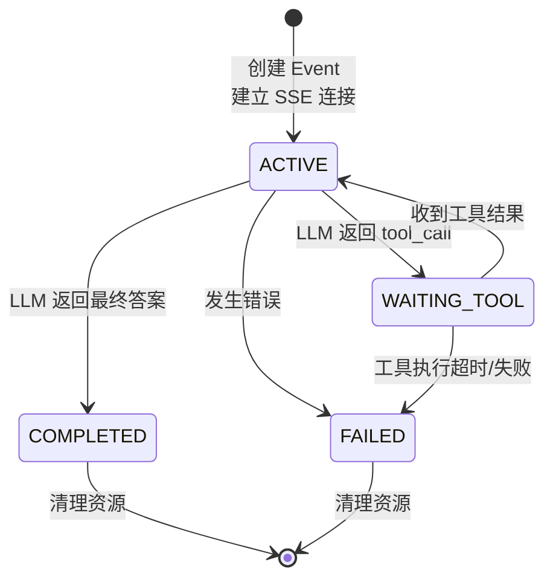

```mermaid
stateDiagram-v2
    [*] --> ACTIVE: 创建 Event<br/>建立 SSE 连接
    
    ACTIVE --> WAITING_TOOL: LLM 返回 tool_call
    WAITING_TOOL --> ACTIVE: 收到工具结果
    
    ACTIVE --> COMPLETED: LLM 返回最终答案
    ACTIVE --> FAILED: 发生错误
    
    WAITING_TOOL --> FAILED: 工具执行超时/失败
    
    COMPLETED --> [*]: 清理资源
    FAILED --> [*]: 清理资源
```