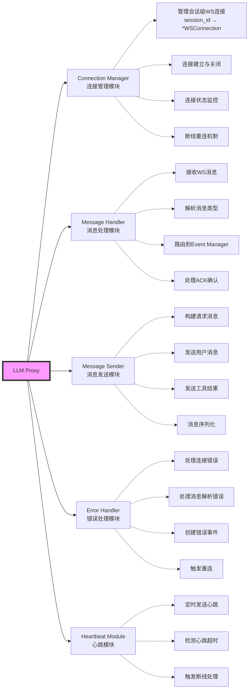

```mermaid
graph LR
    LP[LLM Proxy]
    
    LP --> CM[Connection Manager<br/>连接管理模块]
    LP --> MH[Message Handler<br/>消息处理模块]
    LP --> MS[Message Sender<br/>消息发送模块]
    LP --> EH[Error Handler<br/>错误处理模块]
    LP --> HB[Heartbeat Module<br/>心跳模块]
    
    CM -.-> CM1[管理会话级WS连接<br/>session_id → *WSConnection]
    CM -.-> CM2[连接建立与关闭]
    CM -.-> CM3[连接状态监控]
    CM -.-> CM4[断线重连机制]
    
    MH -.-> MH1[接收WS消息]
    MH -.-> MH2[解析消息类型]
    MH -.-> MH3[路由到Event Manager]
    MH -.-> MH4[处理ACK确认]
    
    MS -.-> MS1[构建请求消息]
    MS -.-> MS2[发送用户消息]
    MS -.-> MS3[发送工具结果]
    MS -.-> MS4[消息序列化]
    
    EH -.-> EH1[处理连接错误]
    EH -.-> EH2[处理消息解析错误]
    EH -.-> EH3[创建错误事件]
    EH -.-> EH4[触发重连]
    
    HB -.-> HB1[定时发送心跳]
    HB -.-> HB2[检测心跳超时]
    HB -.-> HB3[触发断线处理]
    
    style LP fill:#f9f,stroke:#333,stroke-width:4px
```